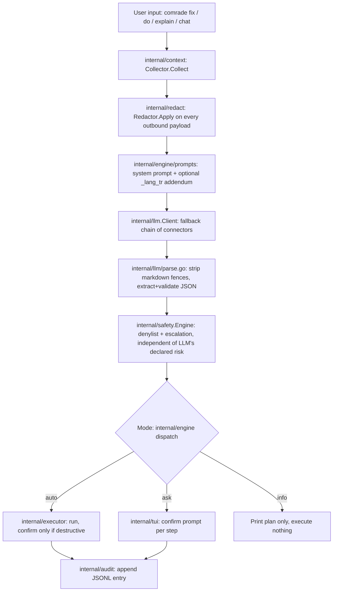

# cli-comrade — Technical Reference

> Türkçe sürüm → [TECHNICAL.tr.md](TECHNICAL.tr.md)

This document explains how `comrade` actually works, package by package,
verified against the source in this repository. For the config key
reference see [CONFIGURATION.md](CONFIGURATION.md); for the safety/threat
model see [SECURITY.md](SECURITY.md); for the phase-by-phase build log see
[docs/phases/](phases/) and [CHANGELOG.md](../CHANGELOG.md).

## 1. Overview & design philosophy

`comrade` is a cross-platform (Linux/macOS/Windows), single-binary Go CLI
that sits between a user and their shell. The user describes what they
want in natural language; comrade turns that into a risk-labeled,
step-by-step plan and — depending on the active **behavior mode** — runs
it, asks for confirmation, or just explains it.

### Behavior modes

| Mode | Behavior |
|---|---|
| `auto` | comrade runs every step itself, printing a one-line summary of what it did at each step. |
| `ask` | **Default.** Before every step, comrade shows its rationale and the command, then prompts with a per-language accept-key legend (see below). |
| `info` | Nothing is ever executed. comrade explains the cause and the fix, with copyable commands. |

Source: `internal/engine/mode.go` (the `Mode` type and `ResolveMode`'s
precedence: `--auto`/`--ask`/`--info` flag > `COMRADE_MODE` env >
`general.mode` config, defaulting to `ask`).

**The ask-mode confirm prompt's key legend is fully i18n'd** — it
renders through the exact same `general.language`/`COMRADE_LANG`/
`LANG`/`LC_ALL`/Windows-system-locale resolution chain (see below) every
other command's output uses (`internal/tui/confirm.go`'s `tr.Lang()`,
fed from the injected `i18n.Translator`; catalog messages
`MsgConfirmLegend` and `MsgConfirmEditHeader`,
`internal/i18n/catalog.go`):

| Choice | TR key | EN key | Meaning |
|---|---|---|---|
| Yes | `e` (evet) | `y` (yes) | Run this step as shown |
| No | `h` (hayır) | `n` (no) | Skip this step |
| Edit | `d` (düzenle) | `e` (edit) | Open inline editing of the command before re-confirming |
| Explain | `a` (açıkla) | `x` (explain) | Show a detailed explanation for this step, then re-prompt |
| All | `t` (tümü) | `a` (all) | Approve this step and every remaining read/write/network step without asking again — destructive/elevated steps still prompt individually |

Rendered legends, verbatim: TR `[e]vet [h]ayır [d]üzenle [a]çıkla
[t]ümü: `, EN `[y]es [n]o [e]dit [x]plain [a]ll: `. `mapKey` resolves
the accepted keypress **strictly by the active language — never as a
union of both key sets**: `e` and `a` collide across TR/EN with
dangerous inversions (TR `e`=Yes vs. EN `e`=Edit; TR `a`=Explain vs. EN
`a`=All), so accepting both languages' keys at once would let a
keypress that means "yes" in one language silently mean "edit" or
"all" in the other — exactly the hazard this per-language split exists
to prevent (`internal/tui/confirm.go`'s own doc comment).

### The one non-negotiable rule

Even in `auto` mode, any command whose **effective risk class is
`destructive`** always stops for confirmation. This can only be
disabled when **both** `safety.confirm_destructive=false` in config
**and** `--yolo` are given together — and every `--yolo` invocation
prints a red warning regardless of whether it actually bypassed
anything that run (`internal/i18n` message `flag_yolo` /
`yolo_warning`; enforced in `internal/engine`'s mode-dispatch loop on
top of `internal/safety.Engine`'s verdict).

### Language stance

comrade's **interface** — every user-facing string in the binary itself
— ships in exactly two languages, Turkish and English, via the
`internal/i18n` catalog (`catalogEN`/`catalogTR` in
`internal/i18n/catalog.go`, one `MessageID` per string, kept in lockstep
by `TestCatalogsCoverIdenticalKeys`). Interface language resolves as:
explicit `general.language` config (`tr`/`en`) wins outright; `auto`
(the default) falls through to `COMRADE_LANG` env > `LANG`/`LC_ALL`
(glibc-style locale prefix match) > **the Windows system locale**
(Windows only, via `GetUserDefaultLocaleName`, e.g. `tr-TR`; always
empty on other platforms since `LANG`/`LC_ALL` already **is** the OS
locale mechanism there) > English fallback (`internal/i18n/lang.go`,
`ResolveLanguage`; §10 has the implementation detail).

The **user's natural-language request itself**, however, is not limited
to Turkish or English — it is whatever free text the user types, and the
configured LLM interprets it in whatever language(s) that model
understands. What comrade controls is the language of the LLM's own
*written-out* fields in its structured response (a plan's `summary` and
each step's `rationale`, an explanation's summary/parts, a diagnosis's
explanation): when the resolved interface language is Turkish, comrade
appends a language instruction to the system prompt — see
`internal/engine/prompts/plan_lang_tr.txt`,
`explain_lang_tr.txt`, `diagnose_lang_tr.txt` — instructing the model to
write those prose fields in Turkish while keeping JSON field names, the
`risk` enum values, and the command text itself untouched (commands are
language-independent). No such addendum is appended for English; the
base system prompts (`plan_system.txt`, `explain_system.txt`,
`diagnose_system.txt`) are English by default. So: **do not describe
comrade as "Turkish/English only"** — describe it as an interface
available in TR/EN, driving an LLM whose prose output language follows
that same TR/EN resolution, on top of a natural-language request the
user can phrase in any language their chosen model supports.

## 2. End-to-end working principle



1. **Context collection** (`internal/context`) — gathers OS/arch
   (`runtime.GOOS`), shell name/version, working directory, the last
   failed command (from `last_command.json`, written by the shell hook —
   §9) with its exit code and captured stderr/stdout tail, detected
   package manager(s) (apt/dnf/pacman/brew/winget/scoop/choco via
   `LookPath`), and — only when explicitly opted in via
   `context.send_history`/`context.send_env_names` config — recent
   shell history and environment **variable names** (never values).
2. **Redaction** (`internal/redact`) — every request payload assembled
   for an LLM call passes through `Redactor.Apply` before it leaves the
   process; see §8 for the exact pattern list. This is wired as a
   hardwired step inside `internal/llm.Client.Complete`/`Stream`
   (`redactPayload`), not something each call site must remember to
   invoke.
3. **Prompt construction** (`internal/engine/prompts`, Go `embed`) — a
   `plan_system.txt` (for `do`/`fix`), `explain_system.txt` (for
   `explain`), or `diagnose_system.txt` (for `fix`'s diagnosis step),
   plus the Turkish addendum described in §1 when applicable, plus a
   few-shot file for diagnosis (`diagnose_fewshot.txt`).
4. **Provider call with fallback** (`internal/llm.Client`) — built from
   `llm.provider + "/" + llm.model` as the first attempt, followed by
   every entry in `llm.fallback`, in order (`New` in `client.go`).
   `Complete`/`Stream` try each attempt in turn with a per-attempt
   timeout (`llm.timeout_seconds`, default 60s); any failure other than
   an auth rejection (401/403, `ErrAuthRejected`) moves to the next
   attempt, an auth rejection aborts the chain immediately, and — if
   every attempt failed with a transport-level (`ErrOffline`) error and
   no attempt was already `ollama` — the final error suggests adding
   `ollama` to `llm.fallback` for offline use.
5. **Structured JSON parse + validation** (`internal/llm/parse.go`) —
   strips Markdown code-fence wrapping the model may have added, extracts
   the single top-level JSON object, and validates every field the
   caller declared in `CompletionRequest.RequiredFields` is present and
   non-empty — all from one shared code path so every command's JSON
   handling is consistent.
6. **Local safety re-check** (`internal/safety.Engine.Evaluate`) — never
   trusts the LLM's own declared risk label beyond treating it as a
   floor. Runs the command through a normalizer/tokenizer
   (`tokenize.go`), then: (a) the built-in denylist — any match is an
   unconditional `Block`, regardless of mode or declared risk; (b) the
   user's `safety.denylist_extra` regexes, same effect; (c) a fixed set
   of escalation rules that can only raise, never lower, the effective
   risk class. See §8 for the concrete rule set.
7. **Mode-based execution loop** (`internal/engine`, `internal/executor`)
   — dispatches per §1's mode table. Execution itself runs `sh -c
   <command>` on non-Windows and `powershell -NoProfile -Command
   <command>` on Windows (`internal/executor/executor.go`,
   `buildCommand`), selected by `runtime.GOOS` at construction time
   (`New`) rather than a build tag, so all three platforms' logic is
   testable from one binary (per CLAUDE.md's platform-branching rule).
   The one exception is process-group kill on timeout/cancellation:
   `Setpgid`/`syscall.Kill` (Unix) vs. `Process.Kill` (Windows) are
   themselves platform-specific syscalls that cannot compile on the
   other `GOOS`, so that narrow piece lives in a build-tagged
   `executor_unix.go`/`executor_windows.go` pair instead (§10 has the
   other such pair in this codebase).
8. **Audit log** (`internal/audit`) — every executed step is appended as
   one JSONL line: `timestamp`, `request` (the original free-text ask),
   `command`, `risk`, `mode`, `exit_code`, `duration_ms`. Read back via
   `comrade history`.

## 3. Architecture / package map

```
cmd/comrade/            main() — builds internal/cli.NewRootCmd and calls Execute
internal/
  cli/                  cobra subcommands, flag wiring, config/runtime glue, i18n-help wiring, color decision (color.go), wait spinner (spinner.go)
  config/                viper loading, schema, OS-specific path resolution, validation
  context/               environment/last-command/history/package-manager collection
  redact/                secret-masking Regexp pipeline, applied to every outbound LLM payload
  engine/                 mode dispatch, plan/explain/diagnose generation, embedded prompts, safety-checked step runner
  executor/               sh -c / powershell -Command process execution, per-OS proc-group handling
  safety/                 risk classification, denylist, escalation rules, Decision type
  audit/                  JSONL execution log + comrade history's reader
  llm/                    Provider interface, 4 connectors, Client fallback chain, JSON parse/validate, SSE streaming
  i18n/                   TR/EN message catalog, MessageID discipline, language resolution
  secrets/                keychain-first (go-keyring) / 0600-file-fallback API key storage
  shellinit/               comrade init's per-shell snippet generation and rc-file block management
  tui/                    bubbletea/lipgloss confirm prompt and status rendering
  update/                  comrade upgrade: GitHub release lookup, checksum-verified download, atomic self-replace
scripts/                 install.sh / install.ps1 (checksum-verified curl/iwr installers)
docs/                    CONFIGURATION.md, SECURITY.md, phases/ (FAZ-00..11 build log), this file
third_party/              vendored atotto-clipboard fork (see §4)
```

Every non-trivial package under `internal/` starts with a `doc.go`
carrying its package-level design comment — read that file first when
orienting in a package.

## 4. Technology stack

| Concern | Choice | Why (as documented in-repo) |
|---|---|---|
| Language / toolchain | Go 1.25 (module), toolchain `go1.26.5` (`go.mod`) | Single static cross-compiled binary |
| CLI framework | `spf13/cobra` v1.10.2 | Subcommand tree, flag parsing, help generation |
| Config | `spf13/viper` v1.21.0 | TOML file load/merge; OS-specific path resolution is comrade's own (`internal/config/paths.go`), not viper's |
| TUI | `charm.land/bubbletea/v2` v2.0.8 + `charm.land/bubbles/v2` + `charm.land/lipgloss/v2` | Confirm prompts, chat input, colored status output |
| Keychain | `github.com/zalando/go-keyring` v0.2.8 | macOS Keychain / Windows Credential Manager / Linux Secret Service, with a 0600 obfuscated-file fallback (`internal/secrets`) when no keychain backend is available |
| HTTP | stdlib `net/http` only | No provider SDKs — `internal/llm`'s four connectors are hand-written raw REST clients, to keep the dependency surface minimal (CLAUDE.md) |
| Release | `goreleaser/v2` v2.16.0 (pinned in `Makefile`) | Cross-platform archives, `.deb`/`.rpm` (nfpm), Homebrew Cask, Scoop bucket, winget manifest — see §11 |
| Testing | stdlib `testing` + `stretchr/testify` v1.11.1 | LLM connectors tested against `httptest` servers, never the real network |

### Vendored fork: `third_party/atotto-clipboard`

`go.mod` has a `replace github.com/atotto/clipboard => ./third_party/atotto-clipboard`.
Upstream `atotto/clipboard` v0.1.4's Unix build runs up to five
sequential `exec.LookPath` PATH scans **unconditionally in a
package-level `init()`** — paid by every `comrade` invocation that
imports `bubbles/v2/textinput` (i.e. essentially every invocation,
including `--version`/`--help`), since the confirm prompt and `comrade
chat` both pull it in transitively. On a PATH with many entries (100+
observed on a WSL2 shell) this cost hundreds of milliseconds per
invocation. The vendored fork's only change defers that same probe from
`init()` to a `sync.Once` triggered by first *actual* clipboard use — see
`third_party/atotto-clipboard/clipboard_unix.go`'s doc comment,
`docs/phases/FAZ-11.md`, and `KNOWN_LIMITATIONS.md`. No newer upstream
release exists to pick up an equivalent fix instead.

**Consequence:** because the module is replaced with a local filesystem
path, `go install github.com/firatkutay/cli-comrade/cmd/comrade@<version>`
does **not** work for an end user — Go's module resolution cannot follow
a `replace ... => ./relative/path` directive across a `go install` module
boundary. Installation must go through a released binary (`scripts/install.sh`
/ `install.ps1`), a package manager (Homebrew Cask / Scoop / winget /
`.deb`/`.rpm`), or a full local clone + `make build`.

## 5. Command reference

Global flags, available on the root command, `do`, and `fix` (registered
by `internal/cli/flags.go`'s `addExecutionFlags`; not on `explain`,
`chat`, `config`, `history`, `init`, `auth`, `upgrade`):

| Flag | Effect |
|---|---|
| `--auto` | Force `auto` mode for this invocation only (overrides `COMRADE_MODE`/config) |
| `--ask` | Force `ask` mode for this invocation |
| `--info` | Force `info` mode for this invocation |
| `--dry-run` | Print the generated plan without executing it |
| `--yolo` | **Dangerous.** Bypass destructive/elevated confirmation in `auto` mode, but only when `safety.confirm_destructive`/`confirm_elevated` are *also* disabled in config. Always prints a red warning when passed. |
| `-h`, `--help` | Standard cobra help |
| `-v`, `--version` | Print `comrade version <version>` and exit |

`--auto`/`--ask`/`--info` are mutually exclusive; passing more than one
is a usage error (`modeFlagValue`, `flags.go`).

**Help output is grouped, has a root Examples section, and is
colorized** (`internal/cli/help.go`). `--help` at any level lists
commands under three i18n'd group titles — Core (`do`/`fix`/`explain`/
`chat`), Setup (`auth`/`init`/`config`), Info (`history`/`upgrade`) —
plus cobra's default "Additional Commands:" bucket for `hook`/`help`
(the auto-generated `completion` command itself is now **hidden** from
help entirely via `cobra.CompletionOptions{HiddenDefaultCmd: true}` —
`comrade completion bash` etc. still works, just isn't advertised).
Cobra's own structural section labels (`Usage:`/`Aliases:`/
`Examples:`/`Available Commands:`/`Additional Commands:`/`Flags:`/
`Global Flags:`/`Additional help topics:`, plus the trailing "Use
`\"...\"` for more information..." line) are also translated now, via
`usageTemplateFor(tr)` — a byte-for-byte structural copy of cobra
v1.10.2's own unexported `defaultUsageTemplate` with only those eight
labels swapped for `tr.T(...)` calls, installed tree-wide via
`root.SetUsageTemplate`. This is a deliberate, documented version-
coupling risk (cobra exposes no programmatic way to derive this
template): `TestUsageTemplateForMatchesCobraDefaultShapeInEnglish`
(`help_test.go`) proves `usageTemplateFor(EN)` renders byte-identical
output to cobra's untouched default for a representative command tree,
so a future cobra template change breaks loudly, not silently — and
`go.mod` pins cobra to an exact version, so this can only go stale on a
conscious upgrade. Root's own `--help` also prints a translated
Examples block (`root.Example`, `MsgHelpExamplesRoot`). When color is
enabled (see below), section/group headers render in a bold pastel
lavender, command names in pastel cyan/teal, and flag names (including
one-letter shorthand) in pastel peach — fixed ANSI256 codes rather than
lipgloss's live-terminal-query-based adaptive color, to avoid paying a
blocking terminal query on every `--help`/`--version` (the same
cold-start concern §13 covers for the vendored clipboard fork).

**Color is decided in exactly one place**: `internal/cli.
resolveColorEnabled` (`internal/cli/color.go`). `general.color=false`
is always the final word — an explicit opt-out. Otherwise,
`colorprofile.Detect` on the target writer decides per-invocation:
plain output by default for a non-TTY/piped run, honoring
[NO_COLOR](https://no-color.org) (unconditionally disables) and
[CLICOLOR_FORCE=1](https://bixense.com/clicolors/) (forces color on
even when not a TTY — what non-interactive `--help` output checks
use). On Windows, when color resolves on, `lipgloss.
EnableLegacyWindowsANSI` opts the console into
`ENABLE_VIRTUAL_TERMINAL_PROCESSING` so legacy `conhost.exe` (still
what Windows PowerShell 5.1 typically runs in) actually interprets the
ANSI it's given — a no-op elsewhere, including when already inside
Windows Terminal/PowerShell 7. Every color-capable call site (help,
the spinner below, chat, `do`/`fix`/`explain`, the ask-mode prompt)
goes through this same function, so there is exactly one place that
ever decides whether ANSI gets written.

`chatModel` (`internal/cli/chatmodel.go`) carries `colorEnabled` from
this same `resolveColorEnabled` decision, computed once in `chat.go`
and passed into `newChatModel`. Wiring it closed a pre-existing leak
in exactly the "single decision point" architecture this paragraph
describes: `bubbles/v2/textinput`'s own `New()` sets its input
prompt's style to `DefaultDarkStyles()` unconditionally, which emits
`\x1b[37m` regardless of `NO_COLOR`, TTY-ness, or
`general.color=false`. `setChatInputPromptStyle` now sets the
prompt's style explicitly, to the pastel-yellow style when enabled or
a genuinely empty `lipgloss.Style{}` otherwise, so a disabled-color
chat session is byte-identical plain output, not merely "not yellow
but still colored." A follow-up review found the identical leak on a
**second** surface — `internal/tui/confirm.go`'s ask-mode edit-mode
(`[e]dit`/`[d]üzenle`) textinput prompt — closed the same way via
`internal/tui/styles.go`'s new `editPromptStyle(colorEnabled)`, applied
to both the `Focused` and `Blurred` `Prompt` style. Its pastel-yellow
value is deliberately **duplicated** as `tui.PromptYellow` rather than
shared through a color package (`internal/tui` cannot import
`internal/cli` — the dependency arrow only runs the other way), guarded
against drift by `internal/cli/color_test.go`'s
`TestPromptYellowMatchesTUIPackage`, which asserts `paletteYellow ==
tui.PromptYellow` and fails the moment either changes independently.
**Open item**: the virtual cursor's own reverse-video rendering
(`\x1b[7;37m`) on both of these textinputs is still unconditional —
deliberately out of this round's scope, tracked in
`docs/PROGRESS.md`, not yet fixed.

**A waiting spinner** (`internal/cli/spinner.go`) animates on stderr
during each blocking LLM call outside a live bubbletea program
(`do`/`fix`'s planning and diagnosis, `explain`) — a braille frame set
borrowed from `bubbles/v2/spinner`'s frame data (not its full
`tea.Model`, since none of these call sites run inside an active
bubbletea program at that point), labeled with the i18n'd "thinking…"
text (`i18n.MsgSpinnerThinking`). It is driven by the same
`resolveColorEnabled` decision (evaluated against stderr), so it is a
complete no-op — no goroutine started, nothing written — whenever
color is off (non-TTY, `general.color=false`, `NO_COLOR`, or
`CLICOLOR_FORCE` needed but absent). Its stop function always blocks
until the spinner line is fully cleared (an ANSI erase-in-line, not a
fixed-width overwrite) before returning, guaranteeing nothing the
caller prints next ever lands on the same line.

Chat is the one exception: it already owns a live bubbletea program, so
it renders its own in-model spinner instead of this stderr one — see
"Inside `comrade chat`" below.

### `comrade` (bare, no subcommand)

Prints the version banner then cobra help. `comrade <free text>` — text
that doesn't match any subcommand name — is dispatched to the same logic
as `comrade do <free text>` (root's `Args: cobra.ArbitraryArgs` +
`RunE`), so e.g. `comrade docker kur` "just works" without typing `do`.
A genuine subcommand typo is therefore *not* rejected with a "did you
mean" suggestion — it free-text-dispatches instead, a deliberate
FAZ 6 UX tradeoff.

```
comrade docker'ı kur
comrade --auto şu portu kim kullanıyor bul ve kapat
```

### `comrade do <request...>`

Explicit form of the free-text dispatch above. Generates a plan for the
request and executes it per the active mode.

```
comrade do "8080 portunu kullanan process'i bul ve durdur"
comrade do --dry-run "install docker"
```

### `comrade fix [-- command...]`

Diagnoses the last failed command (read from `last_command.json`, see
§9) or an explicitly given one, then proposes and — per mode — runs a
fix.

| Flag | Effect |
|---|---|
| `--rerun` | Re-run the last recorded command first, to capture fresh stderr/stdout before diagnosing it |

```
comrade fix
comrade fix --rerun
comrade fix -- npm install
```

### `comrade explain <command...>`

Explains a command flag-by-flag **without ever running it** — no
`executor` is even constructed in this command's dependency graph. Two
layers: (1) the same local `safety.Engine` every other command uses
prints a prominent warning first if the command is destructive or
denylisted; (2) `engine.Explainer` asks the LLM for a plain-language
summary, flag-by-flag breakdown, and its own risk note.

`explain` sets `DisableFlagParsing: true` — the command text being
explained routinely starts with a dash (`-rf`, `-la`) and must not be
parsed as comrade's own flags. Because that also means cobra's own
flag parser (which is what normally intercepts `-h`/`--help` and runs
Args validation) never runs at all for this command, `explain`'s `RunE`
does that handling itself, explicitly: called with no arguments at all,
or with exactly `-h`/`--help`, it shows this command's help
(`cmd.Help()`) instead of making an LLM call; called with no arguments
otherwise, it returns an i18n'd usage error
(`MsgExplainUsageError`) rather than cobra's generic English
`MinimumNArgs` message. To literally explain a command string that is
itself exactly `-h` or `--help`, use the escape hatch `comrade explain
-- -h` — the leading `--` is stripped by `explain` itself (cobra never
strips it here, since `DisableFlagParsing` leaves argument tokens
untouched) and everything after it is explained literally, no matter
what it looks like.

```
comrade explain "git rebase -i HEAD~5"
```

### `comrade chat`

Interactive, context-preserving chat session (bubbletea TUI). No flags
of its own beyond `-h`.

```
comrade chat
```

Inside the session (per `internal/cli/chatdispatch.go`'s slash-style
commands — see `chat_help`'s catalog entry for the authoritative list):
mode switching, clearing context, saving the transcript, and issuing a
`do`-style request without leaving the session.

**The transcript is styled when color is enabled** (`internal/cli/
color.go`'s named palette constants, `internal/cli/chatmodel.go`).
The user's own echoed transcript lines render pastel gray (ANSI256
`245`); `/help`'s rendered slash-command list colors its leading
`/xxx` tokens pastel blue (`111`); the input prompt's `>` renders
pastel yellow (`222`) — both the live `bubbles/v2/textinput` prompt
and the transcript's own echoed `> ` prefix, so the two visually
match. Assistant replies are deliberately left unstyled. With color
disabled, chat output is byte-identical plain text — every one of
these styles is a no-op, not merely a different color.

**Dispatch is async, never inline in `Update`.** Pressing Enter
(`internal/cli/chatmodel.go`) echoes the line immediately, then hands it
to `chatController.dispatchChatLine` — the pure logic behind both a
plain-text turn and `/do` alike — via `runChatTurnCmd`, a `tea.Cmd` that
runs on bubbletea's own command goroutine and reports back through a
`chatTurnDoneMsg`. This is true for `/do` too: it is not a second,
parallel mechanism, just the same dispatch call with a heavier body
(the whole safety-gated plan+execute pipeline, releasing/restoring the
terminal around its own nested confirm program exactly as before).
While a turn is in flight, an in-model spinner
(`charm.land/bubbles/v2/spinner`, styled identically to the stderr
spinner above — same frame set, same color) renders below the
transcript and above the input line, labeled with the same
`i18n.MsgSpinnerThinking` text; a second Enter is ignored until the
current turn resolves, but Ctrl-C always quits immediately regardless.
`chatTurn`'s `CompletionRequest` carries `cfg.LLM.MaxTokens` — every
`Complete` call site in this codebase sets it (a required field for the
Anthropic Messages API in particular; a `0`/unset value is rejected by
the real API with a 400).

### `comrade config <subcommand>`

| Subcommand | Purpose |
|---|---|
| `get <key>` | Print the effective value of a config key |
| `set <key> <value>` | Validate and persist a key (same `SetAndSave` path `config models` uses) |
| `list` | List every key, its effective value, and its source (`env`/`file`/`default`) |
| `edit` | Open the config file in `$EDITOR` |
| `path` | Print the config file's resolved path |
| `models` | List models available for the *currently configured* provider and interactively select one, persisting the choice to `llm.model` |

`config set`, like `explain`, sets `DisableFlagParsing: true` (a value
can itself look like a flag, e.g. `comrade config set safety.
denylist_extra --foo`) and so likewise handles `-h`/`--help` and a
wrong argument count itself — an i18n'd usage error
(`MsgConfigSetUsageError`) rather than cobra's raw English
`ExactArgs(2)` message.

```
comrade config path
comrade config get llm.provider
comrade config set general.mode auto
comrade config models
```

Full key reference: [CONFIGURATION.md](CONFIGURATION.md).

### `comrade auth <subcommand>`

Manages stored provider API keys (keychain-first, file fallback — §7).

| Subcommand | Purpose |
|---|---|
| `login <provider>` | Store a key for `provider`, then send a small test completion to verify it |
| `logout <provider>` | Remove a stored key |
| `status` | Show which providers have a stored (keychain/file) or environment-variable key |

```
comrade auth login anthropic
comrade auth status
```

### `comrade history`

Reads `internal/audit`'s JSONL log and prints recent entries.

| Flag | Effect |
|---|---|
| `--limit <int>` | Max most-recent entries to show (default 20) |
| `--json` | Print each entry as one JSON object per line instead of a table |

```
comrade history --limit 50 --json
```

### `comrade init [bash|zsh|fish|powershell]`

Installs (or removes) the shell integration block in the target shell's
rc/profile file. See §9 for what the hook does at runtime.

**`powershell` on Windows targets every installed PowerShell variant
independently** — Windows PowerShell 5.1 (`powershell.exe`) and
PowerShell 7 (`pwsh.exe`), whichever are actually present
(`internal/shellinit/psprofiles.go`'s `ResolvePowerShellProfiles`).
Each found variant's own `$PROFILE` is queried and the hook installed/
upgraded/removed there via the same idempotent block-marker mechanism
`comrade init` uses for every other shell, with one report line per
profile (variant label + status + path). Only one variant installed is
fine; neither found is an error. When more than one profile needs a
write, a single combined confirmation covers all of them — not one
prompt per profile — and `--yes` skips it as usual. `--remove` mirrors
this per-profile; `--print` is unchanged (it always prints the raw
snippet text, independent of how many profiles exist). On non-Windows,
`powershell` still resolves to `pwsh` only, exactly as before.

| Flag | Effect |
|---|---|
| `--print` | Print the snippet only; make no file changes |
| `--remove` | Remove the cli-comrade block from the rc/profile file(s) |
| `-y`, `--yes` | Skip the confirmation prompt |

The y/N confirmation itself (`confirmYesNo`, `internal/cli/init.go`)
accepts language-appropriate answers: `e`/`evet` when the resolved
interface language is Turkish, `y`/`yes` otherwise — mirroring
`internal/tui/confirm.go`'s per-language, never-merged key discipline
(§1).

```
comrade init bash
comrade init --print zsh
comrade init --remove powershell
```

### `comrade upgrade`

Checks GitHub Releases for a version newer than the running binary's
build-time version and, unless `--check` is given, downloads the
matching platform archive, verifies its checksum against the release's
`checksums.txt`, extracts the binary, and atomically replaces the
currently running executable (including Windows's
can't-overwrite-a-running-exe rename dance).

| Flag | Effect |
|---|---|
| `--check` | Only report whether a newer version is available; do not download/install |

When the repository has no published release at all yet — GitHub's API
returns 404 for that specific case (`update.ErrReleaseNotFound`,
`internal/update/github.go`) — `comrade upgrade`/`--check` prints a
clean i18n'd message (`MsgUpgradeNoReleaseFound`) instead of GitHub's
own raw English 404 JSON body. That distinguishes it from a genuine
fetch failure (network unreachable, a non-200/non-404 status —
`MsgUpgradeFetchFailed`), whose raw HTTP error detail is written to
stderr only when `COMRADE_DEBUG` is set, mirroring `hook.go`'s
established debug-detail convention.

```
comrade upgrade --check
comrade upgrade
```

### Internal (hidden) commands

`comrade hook record --shell <name> --exit <code> --command <text>` —
the sole writer of `last_command.json`; invoked exclusively by the shell
snippets `comrade init` installs, never meant for direct interactive use
(`Hidden: true`, so it never appears in `--help`). See §9.

## 6. LLM providers

`internal/llm.Provider` is the interface every connector implements:

```go
type Provider interface {
    Complete(ctx context.Context, req CompletionRequest) (CompletionResponse, error)
    Stream(ctx context.Context, req CompletionRequest) (<-chan Chunk, error)
    Name() string
}
```

Connector constructors are unexported — the only way to obtain a
`Provider` from outside `internal/llm` is `llm.New(cfg, opts...)`, which
returns a `*Client` wrapping the whole fallback chain (§2 step 4).

| Connector | Backend | Notes |
|---|---|---|
| `anthropic` | Anthropic Messages API | `internal/llm/anthropic.go` |
| `openai_compat` | Any OpenAI-Chat-Completions-compatible endpoint | One connector, parameterized by `llm.openai_compat.base_url` — covers OpenAI, Mistral, Groq, GLM/Zhipu, Qwen, Kimi/Moonshot, OpenRouter, and a local LM Studio server, all through the same wire format |
| `google` | Gemini API | `internal/llm/google.go` |
| `ollama` | Local Ollama (`http://localhost:11434` default) | Model can be left unset and is resolved lazily against `/api/tags` on first use; no API key needed |

**Fallback chain**: built from `llm.provider + "/" + llm.model` as
attempt 1, then every `llm.fallback` entry (`"provider/model"` or bare
`"provider"`) in order. A missing API key for an attempt does not fail
client construction — it becomes a placeholder that returns the precise
"which env var to set" error only when that attempt is actually reached,
so earlier successful attempts are unaffected and later attempts still
get a chance. An HTTP 401/403 (`ErrAuthRejected`) stops the whole chain
immediately (retrying a rejected credential against another provider
makes no sense); any other error (timeout, transport failure, malformed
response) moves to the next attempt.

**Timeout**: `llm.timeout_seconds` (default 60s if unset/non-positive)
wraps every single attempt via `context.WithTimeout`, independently —
one slow attempt does not eat into the next attempt's own budget.

**Streaming**: `Stream` returns `<-chan Chunk`, one contract for all
four connectors: zero or more `{Text, Done:false}` chunks followed by
exactly one `{Done:true, Err}` chunk, after which the channel closes. A
nil `Err` on that final chunk means the stream completed normally.

**Idle timeout**: `llm.idle_timeout_seconds` (default `0`, disabled) is
a second, distinct timeout from `llm.timeout_seconds` above —
`timeout_seconds` bounds the whole request/stream, while
`idle_timeout_seconds` bounds the *gap between two consecutive stream
chunks* (including the gap before the first one). It is enforced in
exactly one place: `Client.Stream`'s `releaseOnClose`, which resets a
single timer every time it forwards a chunk, rather than being
duplicated into each of the four connectors' own read loops. When the
timer fires before another chunk arrives, the stream ends with a final
`Chunk{Done:true, Err: ErrIdleTimeout}` (`internal/llm/errors.go`). A
value of `0` reproduces this package's pre-idle-timeout behavior
exactly — no timer is ever started.

**JSON strategy**: comrade never relies on a provider's native
structured-output parameters — every completion request instead embeds a
"respond with a single JSON object" instruction in the system prompt,
and `internal/llm/parse.go` extracts/validates that JSON from the
response text uniformly across all four connectors (see
`docs/phases/FAZ-02.md`).

**Redaction**: `internal/llm.Client` runs `redactPayload` on every
`CompletionRequest` before any connector sees it — this is not
opt-in per call site (§8).

## 7. Configuration

Full key-by-key reference: [CONFIGURATION.md](CONFIGURATION.md).

| Platform | Config file path |
|---|---|
| Linux/macOS | `$XDG_CONFIG_HOME/cli-comrade/config.toml`, falling back to `~/.config/cli-comrade/config.toml` |
| Windows | `%APPDATA%\cli-comrade\config.toml` |

Created automatically on first run with schema defaults
(`internal/config/loader.go`). Effective-value precedence per key:
environment variable (`COMRADE_...`) > file value > built-in default;
`comrade config list` shows each key's resolved source.

## 8. Security model

Full threat-model writeup: [SECURITY.md](SECURITY.md).

### Risk classes (`internal/safety/risk.go`)

Ascending severity: `read` → `write` → `network` → `elevated` →
`destructive`. Every generated command is labeled by the LLM, then
**independently** re-evaluated by `safety.Engine.Evaluate`, which never
trusts the LLM's label beyond using it as a floor.

### Denylist — unconditional `Block`, any mode

Built-in rule categories (`internal/safety/denylist.go`), matched
against a normalized/tokenized form of the command so quoting can't slip
a match:

- `rm -rf /` (and `~`/`$HOME`-root equivalents)
- `mkfs` (filesystem format)
- `dd of=/dev/<disk>` (raw disk overwrite)
- `diskpart clean` (wipes a disk's partition table)
- PowerShell `Remove-Item`/`ri`/`rd`/`rmdir`/`del`/`erase`/`rm` with
  `-Recurse` targeting a drive root
- `format <drive>:` (Windows format)
- fork bomb (`:(){:|:&};:`)
- `> /dev/<disk>` (shell redirect into a real disk device)

A user can add more via `safety.denylist_extra` (regexes), with the same
unconditional-`Block` effect; a malformed user regex is skipped with a
stderr warning rather than crashing the engine.

### Escalation rules — raise, never lower, the effective risk

`internal/safety/escalation.go`'s fixed rule set: recursive/force delete
flags (`rm -r`/`-f`, PowerShell `-Recurse`/`-Force`), `chmod -R 777`,
disk-device writes, registry deletion (`HKLM:`/`HKCU:`), `killall`/
`taskkill /F`, firewall resets (`iptables -F`, `netsh advfirewall
reset`), `git push --force`/`-f`, `sudo`/`runas`/elevation, package
manager installs, and any command with a network-access verb.

### Redaction (`internal/redact/redact.go`)

Applied to every outbound LLM payload (`internal/llm.Client`, not
opt-in). Pattern set:

- PEM private-key blocks
- `password=`/`token=`/`secret=`/`api_key=`-style key-value pairs (and
  their `:`-separated forms)
- `Authorization: Bearer <token>` headers, and bare `Bearer <token>`
  occurrences
- Known API-key formats: `sk-...` (OpenAI-style), `ghp_`/`gho_` (GitHub),
  `AKIA...` (AWS), `xox[baprs]-...` (Slack)
- JWTs (three-segment base64url)
- Email addresses and IPv4/IPv6 addresses — **optional**, gated by
  `privacy.redact_emails`/`privacy.redact_ips`

Environment variable **values** are never sent; only **names**, and only
when `context.send_env_names` is explicitly opted in.

### Credential storage (`internal/secrets`)

OS keychain first (macOS Keychain / Windows Credential Manager / Linux
Secret Service, via `zalando/go-keyring`), detected by probing a reserved
never-written account name. When no keychain backend is available, falls
back to a single file (`<config dir>/credentials`) created with `0600`
permissions, containing each key **base64-obfuscated — explicitly NOT
encrypted** (the file's own header comment says so), with permissions
repaired to `0600` on every read if they've drifted.

### Audit log (`internal/audit`)

One JSONL entry per executed step: `timestamp`, `request`, `command`,
`risk`, `mode`, `exit_code`, `duration_ms`. Read via `comrade history`.

### `--yolo`

Prints a red warning on every use, unconditionally — independent of
whether it actually bypassed anything in that particular run. Only
takes effect when `safety.confirm_destructive`/`confirm_elevated` are
*also* disabled in config; the destructive-confirmation rule itself is
otherwise non-negotiable (§1).

### Telemetry

Default **off**. If a user opts in, only anonymous usage counters are
sent — never command content (CLAUDE.md security rule #5).

## 9. Shell integration

`comrade init [bash|zsh|fish|powershell]` installs a per-shell hook that,
after every command, execs `comrade hook record --shell <name> --exit
<code> --command <text>` — rather than hand-assembling
`last_command.json`'s JSON inside shell script, which would need
different, unsafe escaping per shell for arbitrary command text (quotes,
unicode, newlines). Encoding is delegated to the compiled binary
(`encoding/json`), so it is correct and identical across every shell.

| Shell | Hook mechanism |
|---|---|
| bash | `PROMPT_COMMAND` |
| zsh | `precmd` |
| fish | `fish_postexec` event |
| PowerShell | A prompt function installed into `$PROFILE`, reading `$?`/`$LASTEXITCODE` |

On Windows, that `$PROFILE` install targets **every installed
PowerShell variant's own profile independently** — Windows PowerShell
5.1 and PowerShell 7 both get the hook when both are present, resolved
via `internal/shellinit.ResolvePowerShellProfiles` (§5 has the full
per-profile install/remove/confirmation behavior). On non-Windows,
`powershell` still means `pwsh`'s single profile only, as it always has.

None of the snippets capture stderr/stdout globally — CLAUDE.md rejects
a global stderr-tee as unreliable across shells — so
`last_command.json` records only `command`, `exit_code`, `shell`, and
`timestamp`. `comrade fix --rerun` captures stderr itself by
controllably re-running the command through `internal/executor` instead.

State file location (`internal/context/lastcommand.go`):

| Platform | Path |
|---|---|
| Windows | `%LOCALAPPDATA%\cli-comrade\last_command.json` |
| Linux/macOS | `$XDG_STATE_HOME/cli-comrade/last_command.json`, falling back to `~/.local/state/cli-comrade/last_command.json` |

`comrade init` is idempotent: re-running it leaves an unchanged block
alone, replaces an outdated snippet version in place, and appends a
missing block — delimited by fixed marker lines
(`internal/shellinit/block.go`).

**No hook installed / fallback**: `comrade fix` still works — it prompts
the user to paste the error, or accepts the failing command directly via
`comrade fix -- <command>`, which re-runs and observes it itself.

## 10. i18n architecture

Every user-facing string routes through `internal/i18n`'s
`MessageID`-keyed catalog (`catalogEN`/`catalogTR` in
`internal/i18n/catalog.go`) via a `Translator.T()` call, or — for
pflag flag descriptions, resolved before any per-invocation `Translator`
exists — `enUsageDefault` plus `internal/cli/help.go`'s
`applyTranslatedHelp`, which walks the whole command tree by
`CommandPath()` after every subcommand is attached and rewrites each
one's `Short`/flag-usage text into the resolved language.

**Windows locale probe**: `ResolveLanguage` (`internal/i18n/lang.go`)
took a third parameter, `systemLocale func() string`, consulted only
when `general.language=auto` and neither `COMRADE_LANG` nor
`LANG`/`LC_ALL` is set — and only once, lazily, never eagerly. Its real
implementation is split across a build-tagged file pair:
`locale_windows.go` (`//go:build windows`) calls kernel32's
`GetUserDefaultLocaleName` via the stdlib `syscall` package to get a
BCP-47 tag like `tr-TR`; `locale_other.go` (`//go:build !windows`)
always returns `""`, since on Linux/macOS `LANG`/`LC_ALL` already *is*
the OS locale mechanism, so there is nothing this step could add there
— behavior on those platforms is therefore unchanged. This pair is one
of the codebase's build-tag isolations from CLAUDE.md's "no build tags,
branch on `runtime.GOOS` instead" rule — the other being
`internal/executor`'s own `executor_unix.go`/`executor_windows.go`
pair, which isolates its process-group kill syscalls the same way (§3).
Both exist for the identical reason: a raw platform syscall (here,
`GetUserDefaultLocaleName`; there, `Setpgid`/`syscall.Kill` vs.
`Process.Kill`) simply cannot compile on the other `GOOS`, so a build
tag is the only way to isolate it — there is no `runtime.GOOS` branch
that would let either function live in one cross-platform file. Both
exceptions are kept equally narrow: `ResolveLanguage` itself and every
other decision in this package stay pure, platform-independent Go,
fully testable on any host `GOOS` via the injectable `systemLocale`
parameter; only the one syscall that does nothing but
return a string needed a build-tagged home.

**Enforcement**: `internal/i18n/catalog_test.go`'s
`TestCatalogsCoverIdenticalKeys`/`TestCatalogsHaveNoEmptyValues` fail the
build if the two catalogs' key sets or non-empty-ness ever diverge.
Separately, `internal/cli/catalog_coverage_test.go` is a Go-AST-based
test — not a golangci-lint rule — that walks every non-test `.go` file
under `internal/cli` and `internal/tui` looking for raw,
letter-containing string literals passed to `fmt.Print*`/`Fprint*`/
`Println`/`Printf` or a pflag description, *or to any `.WriteString(...)`
call* (matched by method name alone, regardless of receiver — this is
what closes the confirm-prompt-shaped blind spot below), outside the
`Translator.T()`/`enUsageDefault` paths, and fails on any file not in
its explicit allowlist.

`internal/tui/confirm.go`'s ask-mode prompt used to be exactly this
blind spot: its legend and edit-mode header were built with
`strings.Builder.WriteString` on raw literals, invisible to a scan that
only recognized `fmt.Print*`/`Fprint*`/`Println`/`Printf`, so the prompt
stayed hardcoded Turkish regardless of `general.language` with nothing
catching it. That is fixed now: the legend and header live in the
catalog as `MsgConfirmLegend` and `MsgConfirmEditHeader`
(`internal/i18n/catalog.go`) — resolved per-language, strictly, never
merged (§1) — and the coverage scan's `WriteString` recognition is what
keeps `confirm.go` (and any future `WriteString`-based prompt) enforced
going forward instead of merely fixed once.

**Documented exceptions**: `internal/cli/catalog_coverage_test.go`'s
`catalogCoverageAllowlist` currently has exactly two entries, each with
its own justification comment in the source, not a blanket exemption —
`TestCatalogCoverageAllowlistHasNoStaleEntries` fails the moment either
one's last flagged literal is migrated away, forcing that entry to be
deleted:

- `hook.go` — `recordLastCommand`'s `COMRADE_DEBUG`-gated diagnostic
  line (fires on every shell prompt, a hot path) and `hook record`'s
  three flag descriptions are deliberately left untranslated: both are
  developer-/internal-facing (an explicit debug env var; a hidden
  command only ever invoked by generated shell snippets), and loading
  config there just to resolve a display language would add overhead to
  code that runs on every single prompt.
- `spinner.go` — the wait spinner's line-clear write is the literal
  `"\r\x1b[K"`, a raw ANSI cursor-return + erase-in-line control
  sequence, not language text; the coverage scan's letter-detection
  heuristic has no way to distinguish the trailing `"K"` of that escape
  code from real prose, so it flags this one non-prose literal — there
  is nothing here for any `i18n.Translator` to translate.

A later QA round (D4b) fixed the two genuine "usage is unreachable"
bugs (`explain`/`config set`'s `-h`/`--help` handling, above) and
translated cobra's own structural template labels, but deliberately
left five residual sources of untranslated English text out of scope
— documented in `docs/PROGRESS.md`, not silently dropped:

1. pflag's own flag-parse errors (`"unknown flag: --x"`, `"unknown
   shorthand flag"`) — pflag exposes no structured error type/sentinel
   for these, only raw English `fmt.Errorf` text; reliably translating
   them would mean regex/string-matching that raw text, fragile across
   pflag version bumps and against this project's own stance against
   parsing raw text for meaning.
2. cobra's own `Args` validator messages (`"accepts N arg(s), received
   M"`, `"unknown command %q for %q"`) on every command **other than**
   `explain`/`config set` — those two are the only ones where the real
   bug was `--help` itself being unreachable; everywhere else
   (`auth login`, `chat`, `history`, ...) `--help` already works fine,
   so only an argument-count *typo message* stays raw English, not a
   "usage is undiscoverable" defect.
3. hidden `completion`'s own generated help text (still English,
   several KB of cobra-generated content with no i18n hook — only its
   *visibility* changed, per the "Help output is grouped..." note
   above).
4. cobra's auto-generated `help` command's own `Short`/`Long` text
   ("Help about any command...") — one line, low impact, and its
   late/lazy initialization timing wasn't verified to reliably
   intersect `applyTranslatedHelp`'s tree-walk.
5. cobra's automatic `-h, --help` flag's own dynamic
   `"help for <command-name>"` description — `flagUsageByName` is built
   for fixed, single-catalog-entry text, not one that varies by command
   name; extending it for this single flag description wasn't judged
   worth the added complexity.

**A second, separate i18n mechanism handles structured errors**, not
raw string literals: `internal/config`'s `Validate`/`Loader.Get`/
`Loader.Source`/`Loader.Set` return typed `*config.UnknownKeyError`/
`*config.InvalidValueError` values (not pre-formatted user-facing
text) for a bad config key or value. `internal/cli/config.go`'s
`translateConfigError` re-renders these through the active
`i18n.Translator` at the CLI boundary, using `errors.As` to match the
error type rather than parsing `internal/config`'s own English
`Error()` string. This is deliberate layering: `internal/config` stays
completely i18n-free (no `internal/i18n` import at all), and every
translation decision lives in `internal/cli` where a `Translator` is
actually available — the same "engine/config packages stay
presentation-agnostic, `internal/cli` renders" split this whole
architecture already follows elsewhere (§2).

## 11. Packaging, distribution & self-update

`goreleaser/v2` (pinned `v2.16.0` in `Makefile`) builds, from
`.goreleaser.yaml`:

- Cross-platform binaries: linux/darwin (amd64, arm64), windows
  (amd64, arm64), archived as `.tar.gz` (`.zip` on Windows)
- `.deb`/`.rpm` packages via `nfpm`
- A **Homebrew Cask** (`homebrew_casks:` — `brews:`/Homebrew Formula is
  deprecated as of goreleaser v2.16 and `goreleaser check` fails on it;
  CLAUDE.md's "brew tap" phrasing predates this and now means a
  Homebrew Cask published to a tap repo, not a Formula)
- A **Scoop** bucket manifest
- A **winget** manifest, submitted as a PR to a staging
  `winget-pkgs` fork

Install scripts `scripts/install.sh`/`install.ps1` download the release
archive matching the host OS/arch, verify it against the release's
published `checksums.txt`, and extract the binary — no package manager
required.

**`comrade upgrade`** (`internal/update`) does the equivalent at
runtime: queries GitHub Releases, compares against the running binary's
build-time version, downloads and checksum-verifies the matching
archive, and atomically replaces the currently running executable
(handling Windows's can't-overwrite-a-running-exe case via a rename
dance).

**Drift guard**: the release archive naming scheme is unavoidably
duplicated in four places — `.goreleaser.yaml`'s `archives[].name_template`,
`scripts/install.sh`, `scripts/install.ps1`, and
`internal/update`'s `ArchiveName`/`BinaryName`/`ChecksumsFileName`. Each
copy is independently valid, so no single-file check catches one
drifting from the other three;
`internal/cli/release_names_test.go`'s
`TestReleaseArchiveNamingIsConsistentAcrossGoreleaserInstallScriptsAndUpdatePackage`
renders/greps all four and cross-checks them bidirectionally, failing on
any one of the four changing alone.

## 12. Testing & CI

- **Table-driven safety tests** (`internal/safety/*_test.go`,
  `hardening_test.go`) cover the denylist and escalation rules across
  Unix and PowerShell command forms.
- **Golden redaction tests** (`internal/redact/redact_test.go`,
  `faz11_hardening_test.go`) assert exact masked output for every known
  key/token format.
- **LLM connector tests** run entirely against `httptest` servers — no
  connector test ever touches the real network.
- **Race tests**: standard `go test -race` coverage across concurrency-
  sensitive packages (streaming, the fallback chain).
- **CI** (`.github/workflows/ci.yml`): a build-and-test matrix across
  `ubuntu-latest`/`macos-latest`/`windows-latest`, plus a separate
  `govulncheck` job.
- **Local gate**: `make vet` (`go vet ./...`), `make lint`
  (`golangci-lint run`, tool pinned to `v2.12.2` in `Makefile`), `make
  test` (`go test ./...`) must all be clean.

`golangci-lint` is **GPL-3.0-licensed** — it is invoked only as an
external development/CI tool (installed via `go install .../cmd/golangci-lint@<pinned version>`
into `$GOPATH/bin`, never imported as a Go module dependency or linked
into the `comrade` binary itself).

## 13. Performance

Cold start is **measured at ~4-5ms** on a native filesystem (`docs/phases/FAZ-11.md`
§3's before/after numbers), roughly a 130x improvement over a ~600ms
regression that FAZ 11 found and fixed (see §4's vendored-clipboard-fork
explanation — the root cause was an unconditional PATH-scanning `init()`
in a transitive dependency). That ~4-5ms/<100ms figure is a
*measurement*, not what CI enforces: the actual regression backstop,
`internal/cli.TestFAZ11ColdStartStaysWellUnderOneSecond`, builds the
real binary and times `--version`/`--help`/`config path`, failing only
if any of them exceeds a deliberately generous **500ms** ceiling
(`coldStartCeiling`, `internal/cli/faz11_coldstart_test.go`) — loose
enough to tolerate a loaded/shared CI runner or a DrvFs-backed checkout
while still catching a gross regression of the same class FAZ 11 found.
See `docs/phases/FAZ-11.md` §3 for the full before/after numbers and
methodology.

## 14. Pointers

- [KNOWN_LIMITATIONS.md](../KNOWN_LIMITATIONS.md) — documented gaps and tradeoffs
- [CHANGELOG.md](../CHANGELOG.md) — release history
- [docs/phases/](phases/) — FAZ-00 through FAZ-11 build log, one file per phase
- [UYGULAMA_PLANI.md](../UYGULAMA_PLANI.md) — the master implementation plan every phase executes against (never modified)
- [docs/PROGRESS.md](PROGRESS.md) — current phase/status, the single source of truth for "where the project is"
