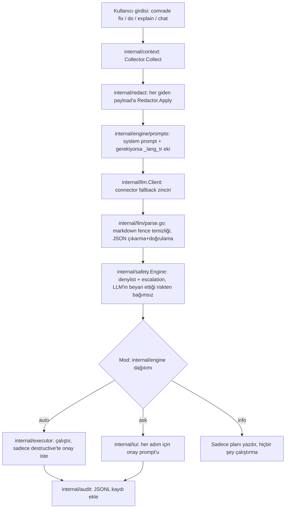

# cli-comrade — Teknik Referans

> English version → [TECHNICAL.md](TECHNICAL.md)

Bu belge `comrade`'ın gerçekte nasıl çalıştığını, bu depodaki kaynak koda
göre doğrulanmış şekilde, paket paket anlatır. Config anahtarlarının tam
listesi için [CONFIGURATION.md](CONFIGURATION.md)'a, güvenlik/tehdit
modeli için [SECURITY.md](SECURITY.md)'a, faz faz geliştirme kaydı için
[docs/history/phases/](history/phases/) ve [CHANGELOG.md](../CHANGELOG.md)'a bakın.

## 1. Genel bakış ve tasarım felsefesi

`comrade`, kullanıcı ile terminal arasına giren, cross-platform
(Linux/macOS/Windows) tek-binary bir Go CLI aracıdır. Kullanıcı ne
istediğini doğal dille tarif eder; comrade bunu risk etiketli, adım adım
bir plana çevirir ve aktif **davranış moduna** göre ya çalıştırır, ya
onay ister ya da sadece açıklar.

### Davranış modları

| Mod | Davranış |
|---|---|
| `auto` | comrade her adımı kendisi çalıştırır, her adımda ne yaptığını tek satırda özetler. |
| `ask` | **Varsayılan.** Her adımdan önce comrade gerekçesini ve komutu gösterir, ardından dile özel bir kabul-tuşu lejantıyla sorar (aşağıya bakın). |
| `info` | Hiçbir şey çalıştırılmaz. comrade nedeni ve çözümü, kopyalanabilir komutlarla açıklar. |

Kaynak: `internal/engine/mode.go` (`Mode` tipi ve `ResolveMode`'un
önceliği: `--auto`/`--ask`/`--info` flag'i > `COMRADE_MODE` ortam
değişkeni > `general.mode` config değeri, varsayılan `ask`).

**Ask-modu onay prompt'unun tuş kümesi artık tamamen i18n'lidir** —
diğer her komutun çıktısının kullandığı aynı
`general.language`/`COMRADE_LANG`/`LANG`/`LC_ALL`/Windows-sistem-yereli
çözümleme zinciri (aşağıya bakın) üzerinden render edilir
(`internal/tui/confirm.go`'nun `tr.Lang()`'i,
enjekte edilen `i18n.Translator`'dan beslenir; katalog mesajları
`MsgConfirmLegend` ve `MsgConfirmEditHeader`,
`internal/i18n/catalog.go`):

| Seçim | TR tuşu | EN tuşu | Anlamı |
|---|---|---|---|
| Evet | `e` (evet) | `y` (yes) | Adımı gösterildiği gibi çalıştır |
| Hayır | `h` (hayır) | `n` (no) | Bu adımı atla |
| Düzenle | `d` (düzenle) | `e` (edit) | Komutu yeniden onaylamadan önce satır içinde düzenle |
| Açıkla | `a` (açıkla) | `x` (explain) | Bu adım için ayrıntılı bir açıklama göster, sonra tekrar sor |
| Tümü | `t` (tümü) | `a` (all) | Bu adımı ve kalan her read/write/network adımını tekrar sormadan onayla — destructive/elevated adımlar yine de tek tek sorulur |

Render edilen lejantlar, birebir: TR `[e]vet [h]ayır [d]üzenle
[a]çıkla [t]ümü: `, EN `[y]es [n]o [e]dit [x]plain [a]ll: `. `mapKey`,
kabul edilen tuş basımını **kesinlikle aktif dile göre çözer — asla iki
tuş kümesinin birleşimi olarak değil**: `e` ve `a`, TR/EN genelinde
tehlikeli tersinmelerle çakışır (TR `e`=Evet vs. EN `e`=Düzenle; TR
`a`=Açıkla vs. EN `a`=Tümü), bu yüzden iki dilin tuşlarını aynı anda
kabul etmek, bir dilde "evet" anlamına gelen bir tuş basımının diğer
dilde sessizce "düzenle" veya "tümü" anlamına gelmesine izin verirdi —
bu dile-özel ayrımın önlemeye çalıştığı tam da bu tehlikedir
(`internal/tui/confirm.go`'nun kendi doc yorumu).

### Pazarlık edilemeyen tek kural

`auto` modda bile, **effective risk sınıfı `destructive`** olan bir
komut her zaman onay için durur. Bu davranış ancak config'de **hem**
`safety.confirm_destructive=false` **hem de** `--yolo` flag'i birlikte
verildiğinde kapanır — ve o çalıştırmada gerçekten bir şeyi atlatıp
atlatmadığından bağımsız olarak, **her** `--yolo` kullanımı kırmızı bir
uyarı basar (`internal/i18n`'deki `flag_yolo`/`yolo_warning` mesajları;
`internal/engine`'in mod-dağıtım döngüsünde, `internal/safety.Engine`'in
verdiğinin üstüne uygulanır).

### Dil tutumu

comrade'ın **arayüzü** — binary'nin kendi ürettiği her kullanıcıya
görünen metin — tam olarak iki dilde gelir, Türkçe ve İngilizce,
`internal/i18n` kataloğu üzerinden (`internal/i18n/catalog.go`'daki
`catalogEN`/`catalogTR`, her string için bir `MessageID`,
`TestCatalogsCoverIdenticalKeys` testiyle iki katalog birbirinden asla
kopmayacak şekilde tutulur). Arayüz dili şu sırayla çözülür: açık
`general.language` config değeri (`tr`/`en`) kesin olarak kazanır;
`auto` (varsayılan) sırayla `COMRADE_LANG` ortam değişkenine >
`LANG`/`LC_ALL`'a (glibc tarzı locale önek eşleşmesi) > **Windows
sistem yereline** (yalnızca Windows'ta, `GetUserDefaultLocaleName` ile,
ör. `tr-TR`; diğer platformlarda her zaman boş, çünkü orada
`LANG`/`LC_ALL` zaten işletim sistemi yerel mekanizmasının kendisidir)
> İngilizce varsayılana düşer (`internal/i18n/lang.go`,
`ResolveLanguage`; uygulama detayı için §10'a bakın).

**Kullanıcının doğal dilde yazdığı istek** ise Türkçe veya İngilizce ile
sınırlı değildir — kullanıcının yazdığı herhangi bir serbest metindir ve
yapılandırılmış LLM bunu, o modelin anladığı hangi dil(ler) olursa
olsun yorumlar. comrade'ın kontrol ettiği şey, LLM'in yapılandırılmış
yanıtındaki kendi yazılı alanlarının dilidir (bir planın `summary`'si ve
her adımın `rationale`'ı, bir açıklamanın özeti/parçaları, bir tanının
açıklaması): çözülen arayüz dili Türkçe olduğunda comrade system
prompt'a bir dil talimatı ekler — bkz.
`internal/engine/prompts/plan_lang_tr.txt`, `explain_lang_tr.txt`,
`diagnose_lang_tr.txt` — modele bu düz-metin alanları Türkçe yazmasını,
ama JSON alan adlarını, `risk` enum değerlerini ve komutun kendisini
(komutlar dilden bağımsızdır) değiştirmeden bırakmasını söyler.
İngilizce için böyle bir ek eklenmez; temel system prompt'lar
(`plan_system.txt`, `explain_system.txt`, `diagnose_system.txt`)
varsayılan olarak zaten İngilizcedir. Dolayısıyla: **comrade'ı "sadece
Türkçe/İngilizce" diye tanımlamayın** — comrade'ı, TR/EN arayüze sahip,
bu aynı TR/EN çözümlemesini LLM'in düz-metin çıktı diline de uygulayan,
ama kullanıcının seçtiği modelin desteklediği herhangi bir dilde
doğal-dil isteği yazabildiği bir araç olarak tanımlayın.

## 2. Uçtan uca çalışma prensibi



1. **Bağlam toplama** (`internal/context`) — OS/mimari
   (`runtime.GOOS`), shell adı/versiyonu, çalışma dizini, son başarısız
   komutu (shell hook'unun yazdığı `last_command.json`'dan — bkz. §9),
   exit code'u ve yakalanan stderr/stdout kuyruğunu, tespit edilen paket
   yöneticisi/yöneticilerini (`LookPath` ile apt/dnf/pacman/brew/winget/
   scoop/choco), ve — yalnızca `context.send_history`/
   `context.send_env_names` config'i açıkça etkinleştirilmişse — son
   shell geçmişini ve ortam değişkeni **isimlerini** (asla değerlerini)
   toplar.
2. **Redaction** (`internal/redact`) — bir LLM çağrısı için hazırlanan
   her istek payload'ı, süreçten çıkmadan önce `Redactor.Apply`'dan
   geçer; tam pattern listesi için §8'e bakın. Bu,
   `internal/llm.Client.Complete`/`Stream` içinde sabitlenmiş bir adım
   olarak bağlanmıştır (`redactPayload`) — her çağrı noktasının
   hatırlaması gereken opsiyonel bir adım değildir.
3. **Prompt oluşturma** (`internal/engine/prompts`, Go `embed`) —
   `plan_system.txt` (`do`/`fix` için), `explain_system.txt` (`explain`
   için) veya `diagnose_system.txt` (`fix`'in tanı adımı için), uygun
   olduğunda §1'de anlatılan Türkçe ek, ve tanı için birkaç örnekli bir
   few-shot dosyası (`diagnose_fewshot.txt`).
4. **Fallback'li provider çağrısı** (`internal/llm.Client`) —
   `llm.provider + "/" + llm.model` ilk deneme olarak, ardından
   `llm.fallback`'teki her girdi sırayla (`client.go`'daki `New`).
   `Complete`/`Stream`, her denemeyi bir per-attempt timeout ile
   (`llm.timeout_seconds`, varsayılan 60sn) sırayla dener; bir auth
   reddi (401/403, `ErrAuthRejected`) dışındaki her hata bir sonraki
   denemeye geçer, bir auth reddi zinciri hemen durdurur, ve — her
   deneme transport seviyesinde (`ErrOffline`) başarısız olduysa ve
   hiçbir deneme zaten `ollama` değilse — son hata, offline kullanım
   için `llm.fallback`'e `ollama` eklemeyi önerir.
5. **Yapılandırılmış JSON ayrıştırma + doğrulama**
   (`internal/llm/parse.go`) — modelin eklemiş olabileceği Markdown
   code-fence sarmalamasını temizler, tek bir üst-seviye JSON nesnesini
   çıkarır, ve çağıranın `CompletionRequest.RequiredFields`'ta beyan
   ettiği her alanın mevcut ve boş olmadığını doğrular — hepsi tek bir
   paylaşılan kod yolundan, böylece her komutun JSON işleme davranışı
   tutarlıdır.
6. **Yerel güvenlik ikinci kontrolü** (`internal/safety.Engine.Evaluate`)
   — LLM'in beyan ettiği risk etiketini asla bir taban değerin ötesinde
   güvenmez. Komutu bir normalizer/tokenizer'dan geçirir
   (`tokenize.go`), ardından: (a) yerleşik denylist — herhangi bir
   eşleşme, mod veya beyan edilen risk ne olursa olsun koşulsuz
   `Block`'tur; (b) kullanıcının `safety.denylist_extra` regex'leri, aynı
   etkiyle; (c) yalnızca effective risk sınıfını yükseltebilen, asla
   düşüremeyen sabit bir escalation kural seti. Somut kural seti için
   §8'e bakın.
7. **Mod tabanlı yürütme döngüsü** (`internal/engine`,
   `internal/executor`) — §1'deki mod tablosuna göre dağıtır. Yürütmenin
   kendisi Windows dışında `sh -c <komut>`, Windows'ta `powershell
   -NoProfile -Command <komut>` çalıştırır
   (`internal/executor/executor.go`, `buildCommand`), bu seçim bir build
   tag yerine kurulum anında `runtime.GOOS`'a göre yapılır (`New`) —
   böylece her üç platformun mantığı tek bir binary'den test edilebilir
   (CLAUDE.md'nin platform-dallanma kuralı gereği). Tek istisna,
   timeout/iptal durumunda process-group öldürme: `Setpgid`/
   `syscall.Kill` (Unix) ile `Process.Kill` (Windows) kendileri
   platforma özel syscall'lardır ve diğer `GOOS`'ta derlenemezler, bu
   yüzden bu dar parça bunun yerine build-tag'li bir
   `executor_unix.go`/`executor_windows.go` çiftinde yaşar (bu kod
   tabanındaki diğer böyle çift için §10'a bakın).
8. **Audit log** (`internal/audit`) — çalıştırılan her adım tek bir JSONL
   satırı olarak eklenir: `timestamp`, `request` (orijinal serbest metin
   istek), `command`, `risk`, `mode`, `exit_code`, `duration_ms`.
   `comrade history` ile geri okunur.

## 3. Mimari / paket haritası

```
cmd/comrade/            main() — internal/cli.NewRootCmd'i kurar ve Execute'u çağırır
internal/
  cli/                  cobra alt komutları, flag bağlama, config/runtime bağlama, i18n-help bağlama, renk kararı (color.go), bekleme spinner'ı (spinner.go), çevrilmiş argüman-sayısı/bilinmeyen-alt-komut doğrulayıcıları (argvalidation.go), shell-tamamlama ValidArgsFunction kablolaması (completion.go)
  config/                viper yükleme, şema, OS'e özel yol çözümleme, doğrulama
  context/               ortam/son-komut/geçmiş/paket-yöneticisi toplama
  redact/                sır maskeleme regex boru hattı, her giden LLM payload'ına uygulanır
  engine/                 mod dağıtımı, plan/explain/diagnose üretimi, gömülü prompt'lar, güvenlik-kontrollü adım koşucusu
  executor/               sh -c / powershell -Command process çalıştırma, OS'e özel process-group yönetimi
  safety/                 risk sınıflandırma, denylist, escalation kuralları, Decision tipi
  audit/                  JSONL yürütme logu + comrade history'nin okuyucusu
  llm/                    Provider arayüzü, 4 connector, Client fallback zinciri, JSON ayrıştırma/doğrulama, SSE streaming
  i18n/                   TR/EN mesaj kataloğu, MessageID disiplini, dil çözümleme
  secrets/                keychain öncelikli (go-keyring) / 0600-dosya-fallback API key depolama
  shellinit/               comrade init'in shell-başına snippet üretimi ve rc-dosyası blok yönetimi
  tui/                    bubbletea/lipgloss onay prompt'u ve durum gösterimi
  update/                  comrade upgrade: GitHub release sorgulama, checksum-doğrulamalı indirme, atomik kendi-kendini-değiştirme
scripts/                 install.sh / install.ps1 (checksum-doğrulamalı curl/iwr kurulum betikleri)
docs/                    CONFIGURATION.md, SECURITY.md, history/phases/ (FAZ-00..11 geliştirme kaydı), bu dosya
third_party/              vendored atotto-clipboard fork'u (bkz. §4)
```

`internal/` altındaki her önemsiz olmayan paket, paket-seviyesi tasarım
yorumunu taşıyan bir `doc.go` ile başlar — bir pakette yön bulmaya bu
dosyayı okuyarak başlayın.

## 4. Teknoloji yığını

| Konu | Seçim | Neden (depodaki dokümantasyona göre) |
|---|---|---|
| Dil / toolchain | Go 1.25 (modül), toolchain `go1.26.5` (`go.mod`) | Tek statik, cross-compile edilebilir binary |
| CLI framework | `spf13/cobra` v1.10.2 | Alt komut ağacı, flag ayrıştırma, help üretimi |
| Config | `spf13/viper` v1.21.0 | TOML dosya yükleme/birleştirme; OS'e özel yol çözümlemesi viper'ın değil comrade'ın kendisinindir (`internal/config/paths.go`) |
| TUI | `charm.land/bubbletea/v2` v2.0.8 + `charm.land/bubbles/v2` + `charm.land/lipgloss/v2` | Onay prompt'ları, chat girdisi, renkli durum çıktısı |
| Keychain | `github.com/zalando/go-keyring` v0.2.8 | macOS Keychain / Windows Credential Manager / Linux Secret Service, hiçbir keychain backend'i mevcut olmadığında 0600 obfuscated-dosya fallback'i ile (`internal/secrets`) |
| HTTP | sadece stdlib `net/http` | Provider SDK'sı yok — `internal/llm`'in dört connector'ı elle yazılmış ham REST istemcileridir, bağımlılık yüzeyini minimumda tutmak için (CLAUDE.md) |
| Release | `goreleaser/v2` v2.16.0 (`Makefile`'da pinlenmiş) | Cross-platform arşivler, `.deb`/`.rpm` (nfpm), Homebrew Cask, Scoop bucket, winget manifest — bkz. §11 |
| Test | stdlib `testing` + `stretchr/testify` v1.11.1 | LLM connector'ları gerçek ağa asla dokunmadan `httptest` sunucularına karşı test edilir |

### Vendored fork: `third_party/atotto-clipboard`

`go.mod`'da bir `replace github.com/atotto/clipboard =>
./third_party/atotto-clipboard` satırı var. Upstream `atotto/clipboard`
v0.1.4'ün Unix build'i, **paket seviyesinde bir `init()` içinde
koşulsuz olarak** beşe kadar sıralı `exec.LookPath` PATH taraması
yapıyor — bunu `bubbles/v2/textinput`'u import eden her `comrade`
çağrısı ödüyor (yani onay prompt'u ve `comrade chat` bunu dolaylı olarak
import ettiği için, `--version`/`--help` dahil, hemen hemen her çağrı).
Çok sayıda girişi olan bir PATH'te (WSL2 shell'inde 100+ gözlemlendi)
bu, çağrı başına yüzlerce milisaniyeye mal oluyordu. Vendored fork'un
tek değişikliği, aynı probu `init()`'ten, ilk **gerçek** clipboard
kullanımında tetiklenen bir `sync.Once`'a ertelemek — bkz.
`third_party/atotto-clipboard/clipboard_unix.go`'nun doc yorumu,
`docs/history/phases/FAZ-11.md`, ve `KNOWN_LIMITATIONS.md`. Bunun yerine eşdeğer
bir düzeltme alacak daha yeni bir upstream release yok (v0.1.4 en
sonuncusu).

**Sonuç:** modül yerel bir dosya sistemi yoluna `replace` edildiği için,
`go install github.com/firatkutay/cli-comrade/cmd/comrade@<versiyon>`
son kullanıcı için **çalışmaz** — Go'nun modül çözümlemesi bir `replace
... => ./göreli/yol` direktifini bir `go install` modül sınırının
ötesinde takip edemez. Kurulum, yayınlanmış bir binary üzerinden
(`scripts/install.sh` / `install.ps1`), bir paket yöneticisi üzerinden
(Homebrew Cask / Scoop / winget / `.deb`/`.rpm`), veya tam bir yerel
clone + `make build` üzerinden yapılmalıdır.

## 5. Komut referansı

Global flag'ler, root komutta, `do`'da ve `fix`'te mevcuttur
(`internal/cli/flags.go`'nun `addExecutionFlags`'i tarafından kaydedilir;
`explain`, `chat`, `config`, `history`, `init`, `auth`, `upgrade`'de
yoktur):

| Flag | Etki |
|---|---|
| `--auto` | Bu çağrı için `auto` modu zorla (COMRADE_MODE/config'i geçersiz kılar) |
| `--ask` | Bu çağrı için `ask` modu zorla |
| `--info` | Bu çağrı için `info` modu zorla |
| `--dry-run` | Üretilen planı çalıştırmadan yazdır |
| `--yolo` | **Tehlikeli.** `auto` modda destructive/elevated onayını atlar, ama yalnızca config'de `safety.confirm_destructive`/`confirm_elevated` da kapalıysa. Verildiğinde her zaman kırmızı bir uyarı basar. |
| `-h`, `--help` | Standart cobra help |
| `-v`, `--version` | `comrade version <versiyon>` yazdırır ve çıkar |

`--auto`/`--ask`/`--info` birbirini dışlar; birden fazlasının verilmesi
bir kullanım hatasıdır (`modeFlagValue`, `flags.go`).

**Help çıktısı gruplanmıştır, bir root Examples bölümü vardır, ve
renklidir** (`internal/cli/help.go`). Herhangi bir seviyede `--help`,
komutları üç i18n'li grup başlığı altında listeler — Core
(`do`/`fix`/`explain`/`chat`), Setup (`auth`/`init`/`config`), Info
(`history`/`upgrade`) — artı `hook`/`help` için cobra'nın varsayılan
"Additional Commands:" kovası (otomatik üretilen `completion` komutu
artık help'ten tamamen **gizlidir** — `cobra.CompletionOptions{
HiddenDefaultCmd: true}` ile; `comrade completion bash` vb. hâlâ
çalışır, sadece reklamı yapılmaz). Cobra'nın kendi yapısal bölüm
etiketleri (`Usage:`/`Aliases:`/`Examples:`/`Available Commands:`/
`Additional Commands:`/`Flags:`/`Global Flags:`/`Additional help
topics:`, artı sondaki "Use `\"...\"` for more information..."
satırı) de artık çevrilidir — `usageTemplateFor(tr)` ile: cobra
v1.10.2'nin kendi export edilmemiş `defaultUsageTemplate`'inin, yalnızca
o sekiz etiket `tr.T(...)` çağrılarıyla değiştirilmiş, birebir yapısal
bir kopyası; `root.SetUsageTemplate` ile tüm ağaca kurulur. Bu bilinçli,
belgelenmiş bir sürüm-eşleşmesi riskidir (cobra bu şablonu programatik
türetmenin hiçbir yolunu sunmuyor):
`TestUsageTemplateForMatchesCobraDefaultShapeInEnglish` (`help_test.go`),
`usageTemplateFor(EN)`'in temsili bir komut ağacı için cobra'nın
dokunulmamış varsayılanıyla birebir aynı çıktı ürettiğini kanıtlar, bu
yüzden gelecekteki bir cobra şablon değişikliği sessizce değil yüksek
sesle bozulur — ve `go.mod` cobra'yı tam bir sürüme sabitlediğinden, bu
yalnızca bilinçli bir yükseltmede bayatlayabilir. Root'un kendi
`--help`'i ayrıca çevrilmiş bir Examples bloğu yazdırır (`root.Example`,
`MsgHelpExamplesRoot`). Renk etkinken (aşağıya bakın), bölüm/grup
başlıkları kalın pastel lavantada, komut adları pastel cyan/tealde, ve
flag adları (tek harfli kısaltmalar dahil) pastel şeftalide render
edilir — lipgloss'un canlı-terminal-sorgusu tabanlı adaptive renk
yerine, her `--help`/`--version`'da
bloklayıcı bir terminal sorgusu ödememek için sabit ANSI256 kodları
(§13'ün vendored clipboard fork'u için ele aldığı aynı cold-start
kaygısı).

**Renk tam olarak tek bir yerde kararlaştırılır**: `internal/cli.
resolveColorEnabled` (`internal/cli/color.go`). `general.color=false`
her zaman son sözdür — açık bir opt-out. Aksi halde, hedef writer
üzerinde `colorprofile.Detect` çağrı-başına karar verir: TTY olmayan/
pipe'lanmış bir çalıştırma için varsayılan düz çıktı,
[NO_COLOR](https://no-color.org)'ı (koşulsuz kapatır) ve
[CLICOLOR_FORCE=1](https://bixense.com/clicolors/)'i (TTY olmasa bile
rengi zorlar — etkileşimli olmayan `--help` çıktı kontrollerinin
kullandığı) onurlandırarak. Windows'ta, renk açık çözüldüğünde,
`lipgloss.EnableLegacyWindowsANSI`, konsolu
`ENABLE_VIRTUAL_TERMINAL_PROCESSING`'e sokar, böylece eski
`conhost.exe` (hâlâ Windows PowerShell 5.1'in tipik olarak çalıştığı
yer) kendisine verilen ANSI'yi gerçekten yorumlar — başka yerlerde
(Windows Terminal/PowerShell 7 içindeyken dahil) bir no-op'tur. Renk
yeteneği olan her çağrı noktası (help, aşağıdaki spinner, chat,
`do`/`fix`/`explain`, ask-modu prompt'u) aynı bu fonksiyondan geçer, bu
yüzden ANSI'nin yazılıp yazılmayacağına karar veren tam olarak tek bir
yer vardır.

`chatModel` (`internal/cli/chatmodel.go`), `colorEnabled`'ı aynı
`resolveColorEnabled` kararından taşır — `chat.go`'da bir kez
hesaplanır ve `newChatModel`'e aktarılır. Bunu bağlamak, bu paragrafın
anlattığı tam "tek karar noktası" mimarisindeki önceden var olan bir
sızıntıyı kapattı: `bubbles/v2/textinput`'in kendi `New()`'i, girdi
prompt'unun stilini koşulsuz olarak `DefaultDarkStyles()`'a ayarlıyordu
— bu da `NO_COLOR`, TTY olma durumu, veya `general.color=false`'dan
bağımsız olarak `\x1b[37m` yayıyordu. `setChatInputPromptStyle` artık
prompt'un stilini açıkça ayarlıyor — etkinken pastel-sarı stile, aksi
halde gerçekten boş bir `lipgloss.Style{}`'a — bu yüzden rengi kapalı
bir chat oturumu bit-bit aynı düz çıktıdır, yalnızca "sarı değil ama
hâlâ renkli" değil. Sonraki bir inceleme, aynı sızıntıyı **ikinci** bir
yüzeyde buldu — `internal/tui/confirm.go`'nun ask-modu düzenleme-modu
(`[e]dit`/`[d]üzenle`) textinput prompt'u — aynı şekilde kapatıldı:
`internal/tui/styles.go`'nun yeni `editPromptStyle(colorEnabled)`'i,
hem `Focused` hem `Blurred` `Prompt` stiline uygulanır. Pastel-sarı
değeri, bir renk paketi üzerinden paylaşılmak yerine bilinçli olarak
`tui.PromptYellow` olarak **tekrarlanmıştır** (`internal/tui`,
`internal/cli`'yi import edemez — bağımlılık oku yalnızca ters yönde
çalışır), `internal/cli/color_test.go`'nun
`TestPromptYellowMatchesTUIPackage`'ı ile drift'e karşı korunur — bu
test `paletteYellow == tui.PromptYellow`'u doğrular ve ikisinden biri
bağımsız değişirse başarısız olur. **Açık kalan madde**: sanal
imlecin kendi ters-video render'ı (`\x1b[7;37m`) bu iki textinput'ta
da hâlâ koşulsuzdur — bu turun kapsamı bilinçli olarak dışında
bırakıldı, `docs/history/PROGRESS.md`'de takip ediliyor, henüz düzeltilmedi.

**Bir bekleme spinner'ı** (`internal/cli/spinner.go`), canlı bir
bubbletea programının DIŞINDAKİ her bloklayan LLM çağrısı sırasında
(`do`/`fix`'in planlama ve tanı adımları, `explain`) stderr üzerinde
animasyon yapar — `bubbles/v2/spinner`'ın frame verisinden ödünç
alınan bir braille frame seti (tam `tea.Model`'i değil, çünkü bu çağrı
noktalarının hiçbiri o anda aktif bir bubbletea programı içinde
çalışmaz), i18n'li "düşünüyor…" metniyle etiketlenir
(`i18n.MsgSpinnerThinking`). Aynı `resolveColorEnabled` kararıyla
(stderr'e karşı değerlendirilir) yönlendirilir, bu yüzden renk
kapalıyken (TTY değil, `general.color=false`, `NO_COLOR`, veya
`CLICOLOR_FORCE` gerekli ama yoksa) tamamen bir no-op'tur — hiçbir
goroutine başlatılmaz, hiçbir şey yazılmaz. Durdurma fonksiyonu,
dönmeden önce spinner satırının tamamen temizlendiğinden (sabit
genişlikte bir üstüne-yazma değil, bir ANSI erase-in-line) her zaman
emin olur, bu da çağıranın bir sonraki yazdırdığı şeyin asla aynı
satıra denk gelmemesini garanti eder.

Chat tek istisnadır: zaten canlı bir bubbletea programı sahipliğinde
olduğundan, bu stderr spinner'ı yerine kendi model-içi spinner'ını
render eder — aşağıdaki "`comrade chat` içinde" bölümüne bakın.

### `comrade` (çıplak, alt komutsuz)

Versiyon banner'ını, ardından cobra help'i yazdırır. `comrade <serbest
metin>` — hiçbir alt komut adıyla eşleşmeyen metin — `comrade do
<serbest metin>` ile aynı mantığa dağıtılır (root'un `Args:
cobra.ArbitraryArgs` + `RunE`'si), böylece örn. `comrade docker kur`
`do` yazmaya gerek kalmadan "çalışır". Gerçek bir alt komut yazım hatası
bu yüzden "şunu mu demek istediniz" önerisiyle reddedilmez — bunun
yerine serbest-metin olarak dağıtılır, FAZ 6'nın bilinçli bir UX
tercihidir.

```
comrade docker'ı kur
comrade --auto şu portu kim kullanıyor bul ve kapat
```

### `comrade do <istek...>`

Yukarıdaki serbest-metin dağıtımının açık formu. İstek için bir plan
üretir ve aktif moda göre çalıştırır.

```
comrade do "8080 portunu kullanan process'i bul ve durdur"
comrade do --dry-run "install docker"
```

### `comrade fix [-- komut...]`

Son başarısız komutu (`last_command.json`'dan okunur, bkz. §9) veya açıkça
verilen bir komutu tanılar, ardından moda göre bir düzeltme önerir ve —
gerekirse — çalıştırır.

| Flag | Etki |
|---|---|
| `--rerun` | Tanılamadan önce son kaydedilen komutu yeniden çalıştırarak taze stderr/stdout yakalar |

```
comrade fix
comrade fix --rerun
comrade fix -- npm install
```

### `comrade explain <komut...>`

Bir komutu **hiçbir zaman çalıştırmadan** flag flag açıklar — bu
komutun bağımlılık grafiğinde bir `executor` bile oluşturulmaz. İki
katman: (1) diğer her komutun kullandığı aynı yerel `safety.Engine`,
komut destructive veya denylist'te ise önce göze çarpan bir uyarı
basar; (2) `engine.Explainer` LLM'den sade dilde bir özet, flag flag
dökümü ve kendi risk notunu ister.

`explain`, `DisableFlagParsing: true` ayarını kullanır — açıklanan
komut metni sıklıkla bir tire ile başlar (`-rf`, `-la`) ve comrade'ın
kendi flag'i olarak ayrıştırılmamalıdır. Bu, cobra'nın kendi flag
ayrıştırıcısının (normalde `-h`/`--help`'i yakalayan ve Args
doğrulamasını çalıştıran) bu komut için hiç çalışmadığı anlamına da
geldiğinden, `explain`'in `RunE`'si bunu kendisi, açıkça ele alır:
hiç argümansız veya tam olarak `-h`/`--help` ile çağrıldığında, bir
LLM çağrısı yapmak yerine bu komutun help'ini gösterir (`cmd.Help()`);
başka türlü argümansız çağrıldığında, cobra'nın genel İngilizce
`MinimumNArgs` mesajı yerine i18n'li bir kullanım hatası
(`MsgExplainUsageError`) döner. Tam olarak `-h` veya `--help` olan bir
komut dizesini birebir açıklamak için `comrade explain -- -h` kaçış
kapısını kullanın — baştaki `--`, `explain`'in kendisi tarafından
kaldırılır (cobra bunu burada asla kaldırmaz, çünkü
`DisableFlagParsing` argüman token'larını dokunulmadan bırakır) ve
ondan sonraki her şey, ne olursa olsun birebir açıklanır.

```
comrade explain "git rebase -i HEAD~5"
```

### `comrade chat`

Etkileşimli, bağlamı koruyan chat oturumu (bubbletea TUI). `-h` dışında
kendi flag'i yok.

**Etkileşimli bir TTY gerektirir.** bubbletea'nın kendisi gerçek bir
terminal gerektirir ve aksi halde TTY olmayan stdin'de asılı kalır;
`comrade chat` artık bunu önceden kontrol eder (`requireInteractiveTTY`,
`internal/cli/runtime.go`) ve stdin pipe'landığında veya yönlendiril-
diğinde asılı kalmak yerine dostane, i18n'li bir hata döner
(`MsgChatRequiresTTY`).

```
comrade chat
```

Oturum içinde (`internal/cli/chatdispatch.go`'nun slash-tarzı komutlarına
göre — otoriter liste için kataloğun `chat_help` girdisine bakın): mod
değiştirme, bağlamı temizleme, transkripti kaydetme, ve oturumdan
çıkmadan `do`-tarzı bir istek gönderme.

**Renk etkinken transkript stillendirilir** (`internal/cli/color.go`'nun
isimli palet sabitleri, `internal/cli/chatmodel.go`). Kullanıcının kendi
yankılanan transkript satırları pastel gri render edilir (ANSI256
`245`); `/help`'in render edilen slash-komut listesi, baştaki `/xxx`
token'larını pastel mavi renklendirir (`111`); girdi prompt'unun `>`'ı
pastel sarı render edilir (`222`) — hem canlı `bubbles/v2/textinput`
prompt'u hem de transkriptin kendi yankılanan `> ` öneki, ikisi görsel
olarak eşleşsin diye. Asistan yanıtları bilinçli olarak stilsiz
bırakılır. Renk kapalıyken, chat çıktısı bit-bit aynı düz metindir —
bu stillerin her biri bir no-op'tur, farklı bir renk değil.

**Gönderim asenkron, hiçbir zaman `Update` içinde senkron değil.**
Enter'a basmak (`internal/cli/chatmodel.go`) satırı hemen ekrana yansıtır,
ardından `chatController.dispatchChatLine`'a — hem düz-metin turunun hem
`/do`'nun ardındaki AYNI saf mantık — `runChatTurnCmd` üzerinden verir:
bubbletea'nın kendi komut goroutine'inde çalışan ve sonucu bir
`chatTurnDoneMsg` ile geri bildiren bir `tea.Cmd`. Bu `/do` için de
geçerli: ikinci, paralel bir mekanizma DEĞİL, yalnızca daha ağır bir
gövdeli (tüm güvenlik-kapılı plan+execute pipeline'ı, terminali kendi iç
içe onay programının etrafında öncekiyle birebir aynı şekilde bırakıp
geri alarak) aynı gönderim çağrısı. Bir tur beklerken, model-içi bir
spinner (`charm.land/bubbles/v2/spinner`, yukarıdaki stderr spinner'ıyla
birebir aynı stilde — aynı frame seti, aynı renk) transkriptin altında ve
girdi satırının üstünde render edilir, aynı `i18n.MsgSpinnerThinking`
metniyle etiketlenir; mevcut tur sonuçlanana kadar ikinci bir Enter yok
sayılır, ama Ctrl-C her zaman koşulsuz anında çıkar. `chatTurn`'ün
`CompletionRequest`'i `cfg.LLM.MaxTokens`'ı taşır — bu kod tabanındaki
HER `Complete` çağrı noktası bunu ayarlar (özellikle Anthropic Messages
API'de zorunlu bir alan; `0`/ayarsız bir değer gerçek API tarafından 400
ile reddedilir).

### `comrade config <alt komut>`

| Alt komut | Amaç |
|---|---|
| `get <anahtar>` | Bir config anahtarının etkin değerini yazdır |
| `set <anahtar> <değer>` | Bir anahtarı doğrula ve kalıcı hale getir (`config models`'ın kullandığı aynı `SetAndSave` yolu) |
| `list` | Her anahtarı, etkin değerini ve kaynağını (`env`/`file`/`default`) listele |
| `edit` | Config dosyasını `$EDITOR`'da aç |
| `path` | Config dosyasının çözümlenmiş yolunu yazdır |
| `models` | **O an yapılandırılmış** provider için mevcut modelleri listele ve etkileşimli olarak birini seç, seçimi `llm.model`'e kalıcı hale getir |

`config` (üst komut) Runnable'dır — `RunE: cmd.Help()` — YALNIZCA kendi
`translatedUnknownSubcommand` `Args` doğrulayıcısının çalışabilmesi için
(cobra'nın `execute()`'u, `Args` hiç kontrol edilmeden önce, Runnable
OLMAYAN bir komutun HERHANGİ bir çağrısı için `flag.ErrHelp` döner);
dürüst yan etki: `comrade config --help` artık öncekinden farklı olarak
bir `comrade config [flags]` "Usage:" satırı da gösteriyor (cobra'nın
şablonu Runnable HERHANGİ bir komut için bunu render eder — kozmetik,
davranış değişikliği değil). Fonksiyonel kazanç: `comrade config bogus`
eskiden sessizce help yazdırıp `0` ile çıkıyordu; artık çevrilmiş,
eyleme geçirilebilir bir `MsgUnknownSubcommandError` (gerçek her alt
komutu, `cmd.Commands()`'tan CANLI olarak adlandırarak) sıfır olmayan
bir çıkış koduyla dönüyor. Tam mekanizma için §10'un "Çevrilmiş
argüman-sayısı ve bilinmeyen-alt-komut kullanım hataları" bölümüne
bakın.

`config set`, `explain` gibi `DisableFlagParsing: true` ayarını
kullanır (bir değer kendisi bir flag gibi görünebilir, ör. `comrade
config set safety.denylist_extra --foo`) ve bu yüzden benzer şekilde
`-h`/`--help`'i ve yanlış argüman sayısını kendisi ele alır — cobra'nın
ham İngilizce `ExactArgs(2)` mesajı yerine i18n'li bir kullanım hatası
(`MsgConfigSetUsageError`). **Bilinen kısıtlama**: `config set`,
`config.toml`'ı `viper.WriteConfigAs` üzerinden yeniden yazar
(`SetAndSave`, `internal/config/loader.go`), ki bu elle yazılmış `#`
yorumlarını korumaz — bir `config set` çalıştırmasından önce dosyada
var olan yorumlar, çalıştırmadan sonra kaybolur; anahtar/değerlerin
kendisi etkilenmez. Bu, önceden var olan, belgelenmiş, bilinçli olarak
ertelenmiş bir kısıtlamadır (bkz. `docs/history/PROGRESS.md`), yeni bir
regresyon değil.

```
comrade config path
comrade config get llm.provider
comrade config set general.mode auto
comrade config models
```

Tam anahtar referansı: [CONFIGURATION.md](CONFIGURATION.md).

### `comrade auth <alt komut>`

Saklanan provider API key'lerini yönetir (keychain öncelikli, dosya
fallback'i — §7). Yukarıdaki `config` gibi, `auth` (üst komut) da
YALNIZCA kendi `translatedUnknownSubcommand` doğrulayıcısının
çalışabilmesi için Runnable'dır — aynı kozmetik `comrade auth [flags]`
"Usage:" satırı eklemesi, aynı `comrade auth bogus`
sessizce-help-0-ile-çık → çevrilmiş-hata düzeltmesi; bkz. §10.

| Alt komut | Amaç |
|---|---|
| `login <provider>` | `provider` için bir key sakla, ardından doğrulamak için küçük bir test completion'ı gönder |
| `logout <provider>` | Saklanan bir key'i kaldır |
| `status` | Hangi provider'ların saklanan (keychain/dosya) veya ortam değişkeni key'i olduğunu göster |

```
comrade auth login anthropic
comrade auth status
```

**`login`, etkileşimli bir TTY gerektirir** (`chat`'in kullandığı aynı
`requireInteractiveTTY` kontrolü, `MsgAuthLoginRequiresTTY`) —
pipe'lanmış/yönlendirilmiş/betiklenmiş bir çağrı, `x/term.ReadPassword`'ın
kendi ham platform errno'su ("inappropriate ioctl for device", Unix'te)
— hiçbir eyleme geçirilebilir neden adlandırmayan — yerine önceden
dostane, i18n'li bir hata alır. Girilen key, **hiçbir şey yazılmadan
önce ping'lenir**: `pingProvider`, key'i doğrudan, bellekte doğrular,
asla store üzerinden değil — bu yüzden reddedilirse geri alınacak
hiçbir şey yoktur. Provider key'i kendisi reddederse
(`llm.ErrAuthRejected`, bir 401/403), `login` gerçek bir komut hatası
döner ve **store'a hiç dokunulmaz** — ne yazma, ne silme, bozuk olduğu
bilinen bir key'in saklı kaldığı bir pencere yok. Diğer her sonuç —
başarı, veya bir ret olmayan ping başarısızlığı (ağ, timeout, geçici
bir 5xx) — ping'den sonra tam olarak bir kez `store.Set`'i çağırır, bu
da orijinal "key yalnızca doğrulanamıyorsa bile sakla" davranışını
korur: çevrimdışı bir kullanıcı, veya geçici bir provider-taraflı hata
yaşayan biri, doğru olduğuna inandığı bir key'i kaydetmekten
engellenmez.

### `comrade history`

`internal/audit`'in JSONL logunu okur ve son kayıtları yazdırır.

| Flag | Etki |
|---|---|
| `--limit <int>` | Gösterilecek en fazla son kayıt sayısı (varsayılan 20) |
| `--json` | Her kaydı tablo yerine satır başına bir JSON nesnesi olarak yazdır |

```
comrade history --limit 50 --json
```

### `comrade init [bash|zsh|fish|powershell]`

Hedef shell'in rc/profile dosyasına shell entegrasyon bloğunu kurar
(veya kaldırır). Hook'un çalışma zamanında ne yaptığı için §9'a bakın.

**Windows'ta `powershell`, kurulu her PowerShell varyantını bağımsız
olarak hedefler** — Windows PowerShell 5.1 (`powershell.exe`) ve
PowerShell 7 (`pwsh.exe`), hangisi gerçekten mevcutsa
(`internal/shellinit/psprofiles.go`'nun `ResolvePowerShellProfiles`'ı).
Bulunan her varyantın kendi `$PROFILE`'ı sorgulanır ve hook, `comrade
init`'in diğer her shell için kullandığı aynı idempotent
blok-marker mekanizmasıyla oraya kurulur/güncellenir/kaldırılır — her
profil için bir rapor satırı (varyant etiketi + durum + yol). Yalnızca
bir varyant kuruluysa sorun yok; hiçbiri bulunamazsa hata verir. Birden
fazla profilin yazma gerektirdiği durumda, hepsini kapsayan **tek bir
birleşik onay** sorulur — profil başına bir prompt değil — ve `--yes`
bunu her zamanki gibi atlar. `--remove`, bunu profil başına yansıtır;
`--print` değişmemiştir (kaç profil olursa olsun her zaman ham
snippet metnini yazdırır). Windows dışında, `powershell` yine yalnızca
`pwsh`'a çözülür, önceden olduğu gibi.

| Flag | Etki |
|---|---|
| `--print` | Sadece snippet'i yazdır; hiçbir dosya değişikliği yapma |
| `--remove` | cli-comrade bloğunu rc/profile dosyasından/dosyalarından kaldır |
| `-y`, `--yes` | Onay prompt'unu atla |

y/N onayının kendisi (`confirmYesNo`, `internal/cli/init.go`), dile
uygun yanıtları kabul eder: çözümlenen arayüz dili Türkçeyse
`e`/`evet`, aksi halde `y`/`yes` — `internal/tui/confirm.go`'nun
dile-özel, asla birleştirilmeyen tuş disiplinini yansıtır (§1).

```
comrade init bash
comrade init --print zsh
comrade init --remove powershell
```

**`comrade init <shell>` shell tamamlamasını da kurar**, hook bloğuna ek
olarak — tam mekanizma (shell-başına kayıt satırları, fish'in kendi ayrı
tamamlama dosyası, ve bu özellikten önceki bir kurulumda neden
`comrade init <shell>`'in bir kez yeniden çalıştırılması gerektiği) için
§9'un "Shell tamamlama" alt bölümüne bakın.

### `comrade upgrade`

GitHub Releases'i çalışan binary'nin build-time versiyonundan daha yeni
bir versiyon için kontrol eder, ve `--check` verilmediyse eşleşen
platform arşivini indirir, release'in `checksums.txt`'ine karşı
checksum'ını doğrular, binary'yi çıkarır, ve o an çalışan executable'ı
atomik olarak değiştirir (Windows'un çalışan-bir-exe'nin-üstüne-yazamama
durumu için rename manevrası dahil).

| Flag | Etki |
|---|---|
| `--check` | Sadece yeni bir versiyonun mevcut olup olmadığını bildir; indirme/kurulum yapma |

Depoda henüz hiç yayınlanmış release yokken — GitHub'ın API'si bu
belirli durum için 404 döner (`update.ErrReleaseNotFound`,
`internal/update/github.go`) — `comrade upgrade`/`--check`, GitHub'ın
kendi ham İngilizce 404 JSON gövdesi yerine temiz, i18n'li bir mesaj
yazdırır (`MsgUpgradeNoReleaseFound`). Bu, gerçek bir fetch
başarısızlığından (ağ erişilemez, 200/404 dışı bir durum —
`MsgUpgradeFetchFailed`) ayırt edilir; onun ham HTTP hata detayı
yalnızca `COMRADE_DEBUG` ayarlıyken stderr'e yazılır,
`hook.go`'nun kendi yerleşik debug-detay kuralını yansıtarak.

```
comrade upgrade --check
comrade upgrade
```

### Dahili (gizli) komutlar

`comrade hook record --shell <isim> --exit <kod> --command <metin>` —
`last_command.json`'un tek yazıcısı; yalnızca `comrade init`'in kurduğu
shell snippet'leri tarafından çağrılır, doğrudan etkileşimli kullanım
için değildir (`Hidden: true`, bu yüzden `--help`'te asla görünmez).
Bkz. §9.

## 6. LLM provider'ları

`internal/llm.Provider`, her connector'ın uyguladığı arayüzdür:

```go
type Provider interface {
    Complete(ctx context.Context, req CompletionRequest) (CompletionResponse, error)
    Stream(ctx context.Context, req CompletionRequest) (<-chan Chunk, error)
    Name() string
}
```

Connector constructor'ları export edilmemiştir (unexported) — `internal/llm`
dışından bir `Provider` elde etmenin tek yolu `llm.New(cfg, opts...)`'tur,
bu da tüm fallback zincirini saran (§2 adım 4) bir `*Client` döner.

| Connector | Backend | Notlar |
|---|---|---|
| `anthropic` | Anthropic Messages API | `internal/llm/anthropic.go` |
| `openai_compat` | Herhangi bir OpenAI-Chat-Completions-uyumlu endpoint | Tek connector, `llm.openai_compat.base_url` ile parametrelenir — OpenAI, Mistral, Groq, GLM/Zhipu, Qwen, Kimi/Moonshot, OpenRouter ve yerel bir LM Studio sunucusunu aynı wire formatı üzerinden kapsar |
| `google` | Gemini API | `internal/llm/google.go` |
| `ollama` | Yerel Ollama (varsayılan `http://localhost:11434`) | Model boş bırakılabilir ve ilk kullanımda `/api/tags`'a karşı tembel olarak çözülür; API key gerekmez |

**Fallback zinciri**: `llm.provider + "/" + llm.model`'den 1. deneme
olarak kurulur, ardından her `llm.fallback` girdisi (`"provider/model"`
veya çıplak `"provider"`) sırayla. Bir deneme için eksik bir API key,
client kurulumunu başarısız kılmaz — o deneme gerçekten ulaşıldığında
"hangi ortam değişkenini ayarlamalı" hatasını döndüren bir placeholder
haline gelir, böylece önceki başarılı denemeler etkilenmez ve sonraki
denemeler hâlâ bir şans elde eder. Bir HTTP 401/403 (`ErrAuthRejected`)
tüm zinciri hemen durdurur (reddedilen bir kimlik bilgisini başka bir
provider'a karşı yeniden denemek anlamsızdır); diğer her hata (timeout,
transport hatası, bozuk yanıt) bir sonraki denemeye geçer. Aynı
sentinel, `comrade auth login`'in yazmadan-önce-doğrulama davranışını
da yönetir (§5): girilen key hiç saklanmadan önce ping'lenir, ve bu
ping'te bir `ErrAuthRejected`, `login`'in key'i hiç yazmaması anlamına
gelir — yazıp sonra geri almak yerine.

**Timeout**: `llm.timeout_seconds` (ayarlanmamışsa/pozitif değilse
varsayılan 60sn), `context.WithTimeout` ile her tek denemeyi bağımsız
olarak sarar — yavaş bir deneme, bir sonraki denemenin kendi bütçesini
yemez.

**Streaming**: `Stream`, dört connector'ın hepsi için aynı sözleşmeyi
taşıyan `<-chan Chunk` döner: sıfır veya daha fazla `{Text, Done:false}`
chunk'ı, ardından tam olarak bir `{Done:true, Err}` chunk'ı, sonra kanal
kapanır. Bu son chunk'ta nil bir `Err`, stream'in normal tamamlandığı
anlamına gelir.

**Idle timeout**: `llm.idle_timeout_seconds` (varsayılan `0`, kapalı),
yukarıdaki `llm.timeout_seconds`'tan ayrı, ikinci bir timeout'tur —
`timeout_seconds` isteğin/stream'in tamamını sınırlarken,
`idle_timeout_seconds` *iki ardışık stream chunk'ı arasındaki boşluğu*
(ilk chunk'tan öncekini de dahil ederek) sınırlar. Tam olarak tek bir
yerde uygulanır: `Client.Stream`'in `releaseOnClose`'u, her bir chunk'ı
ilettiğinde tek bir timer'ı sıfırlar — bu, dört connector'ın kendi okuma
döngülerine ayrı ayrı kopyalanmak yerine yapılır. Timer, başka bir
chunk gelmeden ateşlenirse, stream son bir `Chunk{Done:true, Err:
ErrIdleTimeout}` ile biter (`internal/llm/errors.go`). `0` değeri, bu
paketin idle-timeout-öncesi davranışını tam olarak yeniden üretir — hiç
timer başlatılmaz.

**JSON stratejisi**: comrade hiçbir zaman bir provider'ın native
structured-output parametrelerine güvenmez — her completion isteği
bunun yerine system prompt'a "tek bir JSON nesnesiyle yanıt ver"
talimatını gömer, ve `internal/llm/parse.go` bu JSON'ı, dört connector
genelinde tekdüze olarak, yanıt metninden çıkarır/doğrular (bkz.
`docs/history/phases/FAZ-02.md`).

**Redaction**: `internal/llm.Client`, hiçbir connector bir
`CompletionRequest`'i görmeden önce, her istekte `redactPayload`'ı
çalıştırır — bu her çağrı noktasında opsiyonel değildir (§8).

## 7. Yapılandırma

Anahtar anahtar tam referans: [CONFIGURATION.md](CONFIGURATION.md).

| Platform | Config dosya yolu |
|---|---|
| Linux/macOS | `$XDG_CONFIG_HOME/cli-comrade/config.toml`, yoksa `~/.config/cli-comrade/config.toml`'a düşer |
| Windows | `%APPDATA%\cli-comrade\config.toml` |

İlk çalıştırmada şema varsayılanlarıyla otomatik oluşturulur
(`internal/config/loader.go`). Anahtar başına etkin değer önceliği:
ortam değişkeni (`COMRADE_...`) > dosyadaki değer > yerleşik varsayılan;
`comrade config list` her anahtarın çözümlenmiş kaynağını gösterir.

## 8. Güvenlik modeli

Tam tehdit-modeli yazısı: [SECURITY.md](SECURITY.md).

### Risk sınıfları (`internal/safety/risk.go`)

Artan şiddet sırası: `read` → `write` → `network` → `elevated` →
`destructive`. Üretilen her komut LLM tarafından etiketlenir, ardından
**bağımsız olarak** `safety.Engine.Evaluate` tarafından yeniden
değerlendirilir — bu, LLM'in etiketine bir taban değerin ötesinde asla
güvenmez.

### Denylist — koşulsuz `Block`, hangi mod olursa olsun

Yerleşik kural kategorileri (`internal/safety/denylist.go`), bir
tırnaklama numarasının eşleşmeyi kaçırmasını önlemek için komutun
normalize edilmiş/token'lanmış haline karşı eşleştirilir:

- `rm -rf /` (ve `~`/`$HOME`-root eşdeğerleri)
- `mkfs` (dosya sistemi formatlama)
- `dd of=/dev/<disk>` (ham disk üzerine yazma)
- `diskpart clean` (bir diskin partition tablosunu siler)
- PowerShell `Remove-Item`/`ri`/`rd`/`rmdir`/`del`/`erase`/`rm`,
  `-Recurse` ile bir sürücü kökünü hedefleyerek
- `format <sürücü>:` (Windows format)
- fork bomb (`:(){:|:&};:`)
- `> /dev/<disk>` (gerçek bir disk aygıtına shell redirect'i)

Kullanıcı `safety.denylist_extra` (regex) ile daha fazlasını
ekleyebilir, aynı koşulsuz-`Block` etkisiyle; bozuk bir kullanıcı
regex'i, motoru çökertmek yerine bir stderr uyarısıyla atlanır.

### Escalation kuralları — effective risk'i yalnızca yükseltir, asla düşürmez

`internal/safety/escalation.go`'nun sabit kural seti: recursive/force
silme flag'leri (`rm -r`/`-f`, PowerShell `-Recurse`/`-Force`), `chmod
-R 777`, disk aygıtı yazmaları, registry silme (`HKLM:`/`HKCU:`),
`killall`/`taskkill /F`, güvenlik duvarı sıfırlamaları (`iptables -F`,
`netsh advfirewall reset`), `git push --force`/`-f`, `sudo`/`runas`/
yükseltme, paket yöneticisi kurulumları, ve bir network-erişim fiili
içeren herhangi bir komut.

### Redaction (`internal/redact/redact.go`)

Her giden LLM payload'ına uygulanır (`internal/llm.Client`, opsiyonel
değil). Pattern seti:

- PEM private-key blokları
- `password=`/`token=`/`secret=`/`api_key=` tarzı key-value çiftleri (ve
  `:` ile ayrılmış formları)
- `Authorization: Bearer <token>` header'ları, ve tek başına `Bearer
  <token>` görülümleri
- Bilinen API-key formatları: `sk-...` (OpenAI tarzı), `ghp_`/`gho_`
  (GitHub), `AKIA...` (AWS), `xox[baprs]-...` (Slack)
- JWT'ler (üç segmentli base64url)
- E-posta adresleri ve IPv4/IPv6 adresleri — **opsiyonel**,
  `privacy.redact_emails`/`privacy.redact_ips` ile kapılanır

Ortam değişkeni **değerleri** asla gönderilmez; yalnızca **isimleri**,
ve yalnızca `context.send_env_names` açıkça etkinleştirildiğinde.

### Kimlik bilgisi depolama (`internal/secrets`)

Önce OS keychain'i (macOS Keychain / Windows Credential Manager / Linux
Secret Service, `zalando/go-keyring` üzerinden), asla yazılmayan
ayrılmış bir hesap adı probe edilerek tespit edilir. Hiçbir keychain
backend'i mevcut değilse, tek bir dosyaya (`<config dizini>/credentials`)
`0600` izinleriyle oluşturularak fallback yapılır; içindeki her key
**base64-obfuscated — açıkça ŞİFRELİ DEĞİL** (dosyanın kendi header
yorumu bunu söylüyor), her okumada izinler `0600`'e sapmışsa onarılarak.
Bu fallback kullanıldığında basılan tek seferlik stderr bildirimi
i18n'li ve yumuşatılmıştır (§10) — `internal/secrets`'ın kendisi
hiçbir kelime sağlamaz.

### Audit log (`internal/audit`)

Çalıştırılan her adım için bir JSONL kaydı: `timestamp`, `request`,
`command`, `risk`, `mode`, `exit_code`, `duration_ms`. `comrade
history` ile okunur.

### `--yolo`

O çalıştırmada gerçekten bir şeyi atlatıp atlatmadığından bağımsız
olarak, her kullanımda koşulsuz bir kırmızı uyarı basar. Yalnızca
config'de `safety.confirm_destructive`/`confirm_elevated` **de**
kapalıysa etkili olur; destructive-onay kuralının kendisi aksi halde
pazarlık edilemezdir (§1).

### Telemetri

Varsayılan **kapalı**. Kullanıcı etkinleştirirse, yalnızca anonim
kullanım sayaçları gönderilir — asla komut içeriği (CLAUDE.md güvenlik
kuralı #5).

## 9. Shell entegrasyonu

`comrade init [bash|zsh|fish|powershell]`, her komuttan sonra `comrade
hook record --shell <isim> --exit <kod> --command <metin>`'i exec eden
shell-başına bir hook kurar — `last_command.json`'un JSON'ını shell
script içinde elle birleştirmek yerine, ki bu keyfi komut metni için
(tırnaklar, unicode, satır sonları) shell başına farklı ve güvensiz bir
kaçış gerektirirdi. Encoding, derlenmiş binary'ye devredilir
(`encoding/json`), böylece her shell'de doğru ve aynıdır.

| Shell | Hook mekanizması |
|---|---|
| bash | `PROMPT_COMMAND` |
| zsh | `precmd` |
| fish | `fish_postexec` event'i |
| PowerShell | `$PROFILE`'a kurulan, `$?`/`$LASTEXITCODE`'u okuyan bir prompt fonksiyonu |

Windows'ta bu `$PROFILE` kurulumu, **kurulu her PowerShell varyantının
kendi profilini bağımsız olarak** hedefler — Windows PowerShell 5.1 ve
PowerShell 7'nin ikisi de mevcutsa hook'u alır,
`internal/shellinit.ResolvePowerShellProfiles` üzerinden çözülür (tam
profil-başına kurulum/kaldırma/onay davranışı için §5'e bakın). Windows
dışında, `powershell` her zaman olduğu gibi yalnızca `pwsh`'ın tek
profili anlamına gelir.

Snippet'lerin hiçbiri stderr/stdout'u genel olarak yakalamaz —
CLAUDE.md, shell'ler genelinde güvenilmez olduğu için genel bir
stderr-tee'yi reddeder — bu yüzden `last_command.json` yalnızca
`command`, `exit_code`, `shell`, ve `timestamp` kaydeder. `comrade fix
--rerun`, bunun yerine komutu `internal/executor` üzerinden kontrollü
şekilde yeniden çalıştırarak stderr'i kendisi yakalar.

Durum dosyası konumu (`internal/context/lastcommand.go`):

| Platform | Yol |
|---|---|
| Windows | `%LOCALAPPDATA%\cli-comrade\last_command.json` |
| Linux/macOS | `$XDG_STATE_HOME/cli-comrade/last_command.json`, yoksa `~/.local/state/cli-comrade/last_command.json`'a düşer |

`comrade init` idempotenttir: yeniden çalıştırmak değişmemiş bir bloğu
olduğu gibi bırakır, eski bir snippet versiyonunu yerinde değiştirir, ve
eksik bir bloğu ekler — sabit marker satırlarıyla sınırlanmıştır
(`internal/shellinit/block.go`).

**Hook kurulu değil / fallback**: `comrade fix` yine de çalışır —
kullanıcıdan hatayı yapıştırmasını ister, veya başarısız komutu
doğrudan `comrade fix -- <komut>` ile kabul eder, bu da komutu yeniden
çalıştırır ve kendisi gözlemler.

### Shell tamamlama

`comrade init <shell>`, yukarıdaki hook bloğuna ek olarak Tab-tamamlama
da kurar — cobra'nın kendi yerleşik `__complete` istek protokolü artı
her komuta `ValidArgsFunction` üzerinden kablolanan shell-başına bir
kayıt satırı (`internal/cli/completion.go`).

**Cobra'nın `__complete` protokolü.** `comrade __complete <args...>`,
cobra'nın kendi gizli tamamlama-istek alt komutudur: son argüman
tamamlanmakta olan kısmi kelimedir, ondan önceki her şey satırda zaten
yazılmış olandır. Cobra, aday adlarla (her biri isteğe bağlı olarak
tab ile ayrılmış bir açıklamayla) artı sondaki bir `:<directive>`
satırıyla yanıt verir — comrade yalnızca her komuta bir
`ValidArgsFunction` sağlamak zorunda, istek/yanıt biçiminin kendisini
hiç uygulamıyor.

**`ValidArgsFunction` haritası**, ağaçtaki her komuta kablolanmış:

| Komut / argüman | Adaylar | Kaynak |
|---|---|---|
| kök komut | üst-düzey komut adları | cobra, otomatik (yerleşik, `ValidArgsFunction` gerekmiyor) |
| `auth login`/`logout <provider>` | `secrets.KnownProviders` | `completeFirstArgFromList` |
| `init <shell>` | `bash`, `zsh`, `fish`, `powershell` | `shellinitShellNames()` → `shellinit.All` |
| `config get`/`set <anahtar>` | her gerçek config anahtarı | `config.Keys()` — şemanın kendi listesi, elle kopyalanmış ikinci bir liste değil |
| serbest-metin komutları (`do`, `explain`, `fix`, `chat`, kökün serbest-metin fallback kuyruğu) | yok | `cobra.NoFileCompletions` |
| argümansız her komut (`history`, `upgrade`, `config list/edit/path/models`, `auth status`, ...) | yok | `cobra.NoFileCompletions` |

`completeFirstArgFromList` (completion.go) yalnızca *ilk* pozisyonel
argüman için aday sunar — bir kelime zaten yazılmışsa, (var olmayan)
ikinci argüman hiçbir aday döndürmez, ama dönen directive yine de
`ShellCompDirectiveNoFileComp`'tur, asla cobra'nın dosya-tamamlama-
fallback `Default` directive'i değil. Gizli komutlar (`hook`, ve
`completion`'ın kendisi) de alt-komut-adı adayı olarak hiç görünmez.

**Tamamlama istekleri asla config yüklemez veya ekstra çıktı
yazmaz.** `TestCompletionRequestNeverLoadsConfigOrTouchesStderr`
(completion_test.go) ikisini de doğrudan kontrol eder — diskte hiçbir
config dosyası oluşturulmaz, ve stderr, cobra'nın kendi tek, koşulsuz
`Completion ended with directive: ...` protokol satırının ötesinde
hiçbir şey taşımaz — bu, `comrade __complete ...`'i etkileşimli bir
shell'de her tuş vuruşunda çalışacak kadar hızlı ve sessiz tutar.

**Shell-başına kayıt**, `comrade init <shell>`'in zaten yazdığı aynı
yönetilen marker bloğunun içine eklenir (yukarıda) — asla ayrı, opt-in
bir adım değil:

- **bash** (`internal/shellinit/snippets/bash.sh`):
  `command -v comrade >/dev/null 2>&1 && source <(comrade completion bash)`
- **zsh** (`internal/shellinit/snippets/zsh.sh`):
  `command -v comrade >/dev/null 2>&1 && whence compdef >/dev/null 2>&1 && source <(comrade completion zsh)`
  — `whence compdef` koruması, `compinit` hiç çalıştırılmamışken bile
  bunu güvenli kılar (zsh'nin tamamlama sistemi, bash'ninkinin aksine,
  opt-in'dir).
- **PowerShell** (`internal/shellinit/snippets/powershell.ps1`):
  `comrade completion powershell | Out-String | Invoke-Expression`,
  snippet'in mevcut `if (Get-Command comrade ...)` koruması içinde —
  ikisi de mevcutken her iki PowerShell varyantının profiline aynı
  şekilde kurulur (yukarıda anlatılan çoklu-profil kurulum).
- **fish**: yönetilen rc bloğunun içinde bir satır DEĞİL — fish, bir
  komutun adını tamamlaması gerektiği ilk anda kendi tamamlama
  dizinine yerleştirilmiş herhangi bir dosyayı otomatik olarak
  kaynaklar, bu yüzden `comrade init fish` bunun yerine küçük,
  comrade'a-ait bir dosyayı (`internal/shellinit/snippets/fish-completions.fish`)
  doğrudan o konuma yazar:
  ```fish
  if command -v comrade >/dev/null
      comrade completion fish | source
  end
  ```
  Yolu (`shellinit.FishCompletionsPath`), `RCPath`'in kendi fish
  dalının `config.fish` için zaten kullandığı aynı
  `XDG_CONFIG_HOME`-ya-da-`HOME` zincirinden, bir dizin seviyesi daha
  derinden çözülür: `.../fish/completions/comrade.fish`. Diğer üç
  shell'in paylaştığı marker-sınırlı rc bloklarının aksine, bu dosya
  yalnızca comrade'a aittir, bu yüzden birleştirme/diff mekanizması
  yoktur: kurulum düz bir üzerine-yazmadır, kaldırma düz bir silmedir
  (`shellinit.FishCompletionsScript`/`FishCompletionsPath`). Her iki
  yön de kendi onayını yazdırır
  (`MsgInitFishCompletionsInstalled`/`MsgInitFishCompletionsRemoved`),
  hook-bloğu mesajına EK olarak — asla onun yerine; reddedilen bir
  kurulum onayı ne hook bloğunu ne tamamlama dosyasını yazar.

Her kayıt satırı, `comrade completion <shell>`'e **shell-başlangıç
zamanında** başvurur, `comrade init` zamanında değil — bu yüzden
sonraki bir `comrade upgrade`, `PATH`'teki hangi binary olursa olsun
tamamlamaları otomatik olarak onunla senkron tutar, her upgrade'den
sonra `comrade init`'i yeniden çalıştırmaya gerek kalmadan.

**Gizli `completion` komutu.** Altta yatan `comrade completion
<shell>` komutu (cobra'nın kendi otomatik ürettiği) `--help`'ten gizli
kalır (`root.CompletionOptions.HiddenDefaultCmd = true`) — hiçbir i18n
kancası olmayan, birkaç KB'lık cobra-üretimi, çevrilmemiş yardım metni
— bu projenin teknik olmayan hedef kitlesine göstermeye değmediğine
karar verildi (QA kararı D4b, §10). Tamamen işlevsel kalır; kullanıcılar
tamamlamaları yalnızca `comrade init <shell>` üzerinden alır, asla
`comrade completion`'ı kendileri yazarak değil.

**Mevcut kurulumlar bir kez yeniden çalıştırma gerektirir.** `comrade
init <shell>` idempotenttir — değişmemiş bir hook bloğu olduğu gibi
bırakılır — ama tamamlamalar yeni içeriktir: bu özellikten önceki bir
kurulumda rc dosyasında hiçbir tamamlama satırı yoktur (bash/zsh/
PowerShell) ve hiç tamamlama dosyası yoktur (fish). `comrade init
<shell>`'i bir kez yeniden çalıştırmak, mevcut hook'un üzerine
tamamlamaları da ekler — başka herhangi bir snippet-içeriği
değişikliğinin zaten kullandığı aynı "eski snippet yeniden yazılır"
yolu.

### Boşluk-tetiklemeli komut ipuçları

Tab-tamamlamaya ek olarak, `comrade init <shell>` bunu destekleyen
shell'lerde boşluk-tetiklemeli bir sonraki-kelime ipucu da kurar —
zsh (satır-içi hayalet metin) ve PowerShell (otomatik açılan tamamlama
listesi). Tamamlamalar gibi bu da aynı yönetilen bloğun içine eklenen
yeni içeriktir; mevcut bir kurulum, yukarıda anlatılan aynı bir-kerelik
`comrade init <shell>` yeniden çalıştırmasına ihtiyaç duyar.

**`comrade __hint` sözleşmesi** (`internal/cli/hint.go`). Aşağıdaki
shell widget'ları tarafından her tuş vuruşunda bir kez çağrılan, gizli,
`DisableFlagParsing` bir komut — bu yüzden cobra'nın kendi
`__complete`'i kadar anlık kalmak zorunda:

- `root.Traverse`'i, tamamen aynı `ValidArgsFunction`/`ValidArgs`
  kümesini, ve tamamen aynı alt-komut-görünürlük filtresini
  (`visibleSubcommandNames`, `argvalidation.go` ile paylaşılır) yeniden
  kullanır — `comrade __complete`'in kendisinin de kullandığı — bir
  ipucu Tab-tamamlamanın sunacağından asla sapamaz, çünkü ikisi de aynı
  canlı komut ağacını okur.
- `RunE` değil `Run`, `defer func() { _ = recover() }()` ile sarmalı:
  bu komutun tüm sözleşmesi "asla hata verme, ipucundan başka hiçbir
  şey yazdırma, koşulsuz exit 0" — üçüncü taraf bir
  `ValidArgsFunction`'dan dönen bir hata veya panik, her tuş vuruşunda
  shell'e çıkan etkileşimli bir widget'a asla sızmamalı.
- Köşeli parantez biçimini (`[a|b|c]`) render eder (`formatHintList`),
  `hintMaxLen` = 90 karakterle sınırlı — `comrade config get ` tek
  başına bu bütçeyi zaten aşıyor (20+ config anahtarı) — sığan son
  isimden sonra kesip `|…]` ekler. İlk isim, uzunluğu ne olursa olsun
  her zaman tam olarak dahil edilir, bu yüzden patolojik derecede uzun
  tek bir isim ipucunu boş bir `[|…]`'e çökertemez. Boş adaylar `""`
  olarak render edilir, asla çıplak bir `[]` değil — bu, hem `Run`'a
  hem çağıranlarına tek bir "önerilecek bir şey yok" sinyali verir.
- QA'da çağrı başına ~4ms ölçüldü; çözümleme yolunun herhangi bir
  yerindeki herhangi bir hata yutulur ve hiçbir çıktı üretilmez, asla
  yanıltıcı veya yarım bir ipucu değil.

**zsh widget'ı** (`internal/shellinit/snippets/zsh.sh`), `[[ -o
interactive ]] && zmodload zsh/zle` ile korunur:

- `add-zle-hook-widget line-pre-redraw __comrade_hint_widget` üzerinden
  bağlanır — bir keybinding değil, her-redraw'da çalışan bir hook, bu
  yüzden zsh'nin veya bir kullanıcı eklentisinin zaten sahip olabileceği
  bir tuşu asla talep etmez.
- Yalnızca buffer `comrade\ *` ile eşleşip sonunda boşlukla bitiyorsa
  tetiklenir; buffer'ı `"${(@z)BUFFER}"` ile tokenize eder — tırnaklı,
  `@`-bayraklı biçim, çıplak `${(z)BUFFER}` değil — çünkü tırnaksız
  `(z)`-bölünmüş kelimeler `setopt GLOB_SUBST` altında glob-uygundur, ve
  glob metakarakteri içeren bir buffer kelimesi aksi halde redraw
  sırasında bir `no matches found` hatası sızdırabilir.
- Çözümlenen ipucunu `POSTDISPLAY`'e (zsh'nin kendi "imleçten sonraki
  hayalet metin" mekanizması) yazar, ve `__comrade_hint_owns` ile
  sahipliği takip eder, böylece `POSTDISPLAY`'i yalnızca ya hiçbir şey
  onu talep etmemişse ya da onu en son comrade'ın kendisi ayarlamışsa
  üzerine yazar — zsh-autosuggestions ile bu şekilde bir arada var
  olur: mevcut bir öneriyi ezmek yerine her zaman ona öncelik verir.
- Kendi `region_highlight` girdisini `memo=comrade` etiketiyle uygular,
  böylece ipucu soluk/vurgusuz render edilir, ve her yazmadan önce aynı
  etiket üzerinde dedupe eder
  (`region_highlight=( ${region_highlight:#*memo=comrade} )`), böylece
  yeniden render'lar asla yinelenen vurgu aralıkları biriktirmez.
- Buffer artık sondaki-boşluk desenine uymadığı anda (yani kullanıcı
  yazmaya devam ettiğinde) — ve yalnızca mevcut display'in sahibi
  comrade'ın kendisiyse — `POSTDISPLAY`'i ve vurguyu temizler.

**PowerShell işleyicisi** (`internal/shellinit/snippets/powershell.ps1`):

- Yalnızca `SelfInsert` olmayan mevcut bir Boşluk
  `PSReadLineKeyHandler` kayıtlı DEĞİLSE kurulur — özel bir kullanıcı
  boşluk bağlaması tamamen dokunulmadan bırakılır.
- İşleyici boşluğu kendisi ekler (`PSConsoleReadLine::Insert(' ')`),
  buffer'ı `GetBufferState` ile geri okur, ve — yalnızca buffer `^\s*
  comrade(\.exe)?(\s+[\w-]+)*\s$` ile eşleşiyorsa —
  `PSConsoleReadLine::PossibleCompletions()`'ı çağırır, bu da
  PSReadLine'ın kendi tamamlama listesini satırın altında render eder.
  Bu bir liste render'ıdır, satır-içi hayalet metin değil: boşlukta
  gerçek satır-içi hayalet metin, kasıtlı olarak sunulmayan derlenmiş
  bir PSReadLine `ICommandPredictor` eklentisi gerektirirdi.
- Kayıt `try`/`catch` içine sarılıdır: herhangi bir başarısızlıkta
  (ör. eski bir PSReadLine'da `Set-PSReadLineKeyHandler` mevcut
  değilse) sessizce geriler — kullanıcıya hiçbir hata görünmez, ve
  yukarıdaki shell kancası ile Tab-tamamlama her durumda etkilenmeden
  kalır.
- Hem Windows PowerShell 5.1 hem pwsh 7'de doğrulandı.

**bash**: boşluk-tetiklemeli ipucu yok. bash'in readline'ında,
comrade'ın boşluk tuşunu yeniden bağlamadan kancalayabileceği bir
hayalet-metin veya tuş-basımında-otomatik-liste ilkeli yok, ve boşluğu
yeniden bağlamak güvensiz — magic-space ve yapıştırmayı bozar. bash
yalnızca Tab / çift-Tab tamamlamasını korur (yukarıda anlatılan
tamamlama mekanizması), `bash.sh`'nin kendisinde satır-içi
belgelenmiştir.

**fish**: yeni bir mekanizma eklenmedi. fish'in kendi yerleşik
yazarken-otomatik-öneri özelliği, `comrade`'ın tamamlamalarını
(`fish-completions.fish`) `comrade ` sonrası gri satır-içi hayalet
metin olarak zaten render ediyor, bu yüzden ayrı bir boşluk-tetiklemeli
ipucu gereksiz olurdu.

## 10. i18n mimarisi

Kullanıcıya görünen her metin, bir `Translator.T()` çağrısı üzerinden
`internal/i18n`'in `MessageID`-anahtarlı kataloğundan geçer
(`internal/i18n/catalog.go`'daki `catalogEN`/`catalogTR`), veya — henüz
bir per-invocation `Translator` mevcut olmadan çözümlenen pflag flag
açıklamaları için — `enUsageDefault` artı `internal/cli/help.go`'nun
`applyTranslatedHelp`'i, ki bu, her alt komut eklendikten sonra komut
ağacının tamamını `CommandPath()`'e göre dolaşıp her birinin
`Short`/flag-usage metnini çözümlenen dile yeniden yazar.

**Windows yerel prob'u**: `ResolveLanguage` (`internal/i18n/lang.go`)
üçüncü bir parametre aldı, `systemLocale func() string` — yalnızca
`general.language=auto` iken ve ne `COMRADE_LANG` ne de
`LANG`/`LC_ALL` ayarlıyken danışılır — ve yalnızca bir kez, tembel
olarak, asla istekli değil. Gerçek uygulaması, build-tag'li bir dosya
çiftine bölünmüştür: `locale_windows.go` (`//go:build windows`),
`tr-TR` gibi bir BCP-47 etiketi almak için stdlib `syscall` paketi
üzerinden kernel32'nin `GetUserDefaultLocaleName`'ini çağırır;
`locale_other.go` (`//go:build !windows`) her zaman `""` döner, çünkü
Linux/macOS'ta `LANG`/`LC_ALL` zaten işletim sistemi yerel
mekanizmasının kendisidir, bu yüzden bu adımın orada ekleyebileceği
hiçbir şey yoktur — o platformlardaki davranış bu yüzden değişmemiştir.
Bu çift, CLAUDE.md'nin "build tag yok, bunun yerine `runtime.GOOS`'a
göre dallan" kuralından kod tabanındaki build-tag izolasyonlarından
biridir — diğeri `internal/executor`'ın kendi
`executor_unix.go`/`executor_windows.go` çiftidir, ki bu da
process-group öldürme syscall'larını aynı şekilde izole eder (§3). İkisi
de aynı nedenle vardır: ham bir platform syscall'ı (burada
`GetUserDefaultLocaleName`; orada `Setpgid`/`syscall.Kill` vs.
`Process.Kill`) diğer `GOOS`'ta derlenemez bile, bu yüzden onu izole
etmenin tek yolu bir build tag'idir — hiçbir ikisinin de tek bir
cross-platform dosyada yaşamasına izin verecek bir `runtime.GOOS` dalı
yoktur. Her iki istisna da eşit derecede dar tutulmuştur —
`ResolveLanguage`'ın kendisi ve bu paketteki her diğer karar saf,
platformdan bağımsız Go olarak kalır, enjekte edilebilir
`systemLocale` parametresi sayesinde herhangi bir host `GOOS`'ta tam
olarak test edilebilir; yalnızca bir string döndürmekten başka bir şey
yapmayan tek syscall'ın build-tag'li bir eve ihtiyacı vardı.

**Denetim**: `internal/i18n/catalog_test.go`'nun
`TestCatalogsCoverIdenticalKeys`/`TestCatalogsHaveNoEmptyValues`'ı, iki
kataloğun anahtar setleri veya boş-olmama durumu birbirinden koparsa
build'i başarısız kılar. Ayrıca, `internal/cli/catalog_coverage_test.go`
— bir golangci-lint kuralı değil, Go-AST tabanlı bir test — `internal/cli`
ve `internal/tui` altındaki test-olmayan her `.go` dosyasını dolaşarak
`Translator.T()`/`enUsageDefault` yollarının dışında `fmt.Print*`/
`Fprint*`/`Println`/`Printf`'e veya bir pflag açıklamasına verilen ham,
harf içeren string literal'ları, *veya herhangi bir `.WriteString(...)`
çağrısına* verilenleri (alıcıdan bağımsız, yalnızca metot adına göre
eşleştirilir — aşağıdaki confirm-prompt-şeklindeki kör noktayı kapatan
tam olarak budur) arar ve kendi açık allowlist'inde olmayan herhangi
bir dosyada başarısız olur.

`internal/tui/confirm.go`'nun ask-modu prompt'u eskiden tam olarak bu
kör noktaydı: lejantı ve edit-modu başlığı, yalnızca `fmt.Print*`/
`Fprint*`/`Println`/`Printf`'i tanıyan bir taramaya görünmez olan ham
literal'larla `strings.Builder.WriteString` kullanılarak inşa
ediliyordu — bu yüzden prompt, hiçbir şey yakalamadan
`general.language`'tan bağımsız olarak sabit Türkçe kalıyordu. Bu artık
düzeltildi: lejant ve başlık kataloğun içinde `MsgConfirmLegend` ve
`MsgConfirmEditHeader` olarak yaşıyor (`internal/i18n/catalog.go`) —
dile göre, kesinlikle, asla birleştirilmeden çözülür (§1) — ve kapsam
taramasının `WriteString` tanıması, `confirm.go`'yu (ve gelecekteki
herhangi bir `WriteString` tabanlı prompt'u) yalnızca bir kez
düzeltmek yerine bundan sonra da denetimde tutan şeydir.

**Belgelenmiş istisnalar**: `internal/cli/catalog_coverage_test.go`'nun
`catalogCoverageAllowlist`'inde şu anda tam olarak iki girdi var, her
biri kaynak kodda kendi gerekçe yorumuyla — genel bir muafiyet değil;
`TestCatalogCoverageAllowlistHasNoStaleEntries`, ikisinden birinin son
işaretlenmiş literal'i taşındığı anda başarısız olur, bu da o girdinin
silinmesini zorunlu kılar:

- `hook.go` — `recordLastCommand`'ın `COMRADE_DEBUG`-kapılı tanı satırı
  (her shell prompt'unda tetiklenir, sıcak bir yol) ve `hook record`'un
  üç flag açıklaması bilinçli olarak çevrilmeden bırakılmıştır: ikisi de
  geliştirici-/dahili-yönelimlidir (açık bir debug ortam değişkeni;
  yalnızca üretilen shell snippet'leri tarafından çağrılan gizli bir
  komut), ve orada bir görüntüleme dilini çözmek için config yüklemek,
  her tek prompt'ta çalışan koda ek yük getirir.
- `spinner.go` — bekleme spinner'ının satır temizleme yazımı, tam olarak
  `"\r\x1b[K"` literal'idir — bir dil metni değil, ham bir ANSI
  imleç-döndürme + satır-içi-silme kontrol dizisi; kapsam taramasının
  harf-tespit sezgisi, bu escape kodunun sonundaki `"K"`'yı gerçek
  düzyazıdan ayırt edemez, bu yüzden bu tek düzyazı-olmayan literal'i
  işaretler — burada herhangi bir `i18n.Translator`'ın çevirebileceği
  hiçbir şey yoktur.

Sonraki bir QA turu (D4b), iki gerçek "usage erişilemez" hatasını
düzeltti (`explain`/`config set`'in `-h`/`--help` ele alışı, yukarıda)
ve cobra'nın kendi yapısal şablon etiketlerini çevirdi, ama o sırada beş
kalıntı çevrilmemiş İngilizce metin kaynağını bilinçli olarak kapsam
dışı bıraktı — `docs/history/PROGRESS.md`'de belgelendi, sessizce atlanmadı.
Sonraki bir değişiklik bu beşten birini (argüman-sayısı/bilinmeyen-alt-
komut mesajları, önceki madde 2) tamamen kapattı — bkz. aşağıdaki
"Çevrilmiş argüman-sayısı ve bilinmeyen-alt-komut kullanım hataları" —
geriye dört tanesi kaldı:

1. pflag'in kendi flag-ayrıştırma hataları (`"unknown flag: --x"`,
   `"unknown shorthand flag"`) — pflag bunlar için hiçbir
   yapılandırılmış hata tipi/sentinel sunmuyor, yalnızca ham İngilizce
   `fmt.Errorf` metni; güvenilir çevirisi bu ham metni regex/
   string-eşleştirmeyle ayrıştırmayı gerektirir, pflag sürüm
   güncellemelerinde kırılgan ve bu projenin "ham metin ayrıştırma"
   karşıtı duruşuyla çelişir.
2. gizli `completion`'ın kendi üretilen yardım metni (hâlâ İngilizce,
   i18n kancası olmayan birkaç KB'lık cobra-üretimi içerik — yalnızca
   *görünürlüğü* değişti, yukarıdaki "Help çıktısı gruplanmıştır..."
   notuna bakın).
3. cobra'nın otomatik üretilen `help` komutunun kendi `Short`/`Long`
   metni ("Help about any command...") — tek satır, düşük etki, ve
   geç/tembel başlatma zamanlamasının `applyTranslatedHelp`'in
   ağaç-yürüyüşüyle güvenilir şekilde kesiştiği doğrulanmadı.
4. cobra'nın otomatik `-h, --help` flag'inin kendi dinamik
   `"help for <command-name>"` açıklaması — `flagUsageByName`, sabit,
   tek-katalog-girdili metinler için tasarlandı, komut adına göre
   değişen bir metin için değil; bu tek flag açıklaması için
   genişletmek, katılan karmaşıklığa değer görülmedi.

**Çevrilmiş argüman-sayısı ve bilinmeyen-alt-komut kullanım hataları**,
yukarıdaki eski madde 2'yi, `explain`/`config set` (farklı, daha
kapsamlı `--help`'in-kendisinin-erişilemez-olması düzeltmesini
gerektirmişlerdi, yukarıda ele alındı) HARİÇ ağaçtaki her komut için
kapatır. `internal/cli/argvalidation.go`'nun `translatedExactArgs`/
`translatedMinArgs`/`translatedMaxArgs`/`translatedNoArgs`/
`translatedUnknownSubcommand`'ı, tek bir paylaşılan
`cobra.PositionalArgs` fabrikası (`translatedPositionalArgs`)
etrafındaki beş ince sarmalayıcıdır; kalan her komutun `Args` alanı
artık `cobra.ExactArgs`/`MinimumNArgs`/`MaximumNArgs`/`NoArgs`'ı
doğrudan kullanmak yerine bunlardan birini kullanıyor — cobra'nın ham
İngilizce `"accepts N arg(s), received M"` / `"unknown command %q for
%q"`'sunu, `bestEffortTranslator(cmd, newLoader)` üzerinden render
edilen dostane bir mesajla değiştiriyor — bu ağaçtaki her diğer
kullanım-hatası yolunun zaten kullandığı aynı `general.language`-öncelikli
çözümleme. Yedi yeni MessageID bunu kapsıyor: beşi komuta-özel
(`MsgAuthLoginUsageError`, `MsgAuthLogoutUsageError`, `MsgDoUsageError`,
`MsgInitUsageError`, `MsgConfigGetUsageError`) artı birçok komut arasında
paylaşılan ikisi — `MsgUsageNoArgsError` (her argümansız yaprak komut,
çözümlenen `cmd.CommandPath()`'e göre parametrelenmiş tek bir mesaj) ve
`MsgUnknownSubcommandError` (uyuşmayan bir alt komut adı verilen bir üst
komut, ör. `comrade auth bogus`, aday listesi elle kopyalanmak yerine
`cmd.Commands()`'tan canlı olarak kaynaklanır).

**Yan etki: `auth`/`config` Runnable oldu.** cobra'nın `execute()`'u,
`Args` doğrulayıcısı hiç çalışmadan önce, Runnable OLMAYAN herhangi bir
komutun HERHANGİ bir çağrısı için `flag.ErrHelp` döner — bu yüzden
`translatedUnknownSubcommand`'ı `auth`/`config`'e kablolamak, her
ikisine de (`hook.go`'nun önceden var olan desenini yansıtan) basit bir
`RunE: func(cmd, _) error { return cmd.Help() }` vermeyi de gerektirdi,
yalnızca `Runnable()`'ı doğru yapmak için. Dürüstçe belgelendi: her iki
üst komutun kendi `--help`'i artık öncekinden farklı olarak bir
`comrade auth [flags]`/`comrade config [flags]` "Usage:" satırı da
render ediyor (cobra'nın şablonu Runnable HERHANGİ bir komut için bunu
render eder) — kozmetik, davranış regresyonu değil. Fonksiyonel kazanç:
`comrade auth bogus`/`comrade config bogus` eskiden sessizce help
yazdırıp `0` ile çıkıyordu; ikisi de artık gerçek her alt komutu
adlandıran, çevrilmiş, sıfır olmayan çıkış kodlu bir hata döndürüyor.

**`hook`'un `Args` düzeltmesi daha hafif, ayrı bir boşluktur**, aynı
hata sınıfı değil: `hook` (ve çocuğu `hook record`) zaten `RunE`'a
sahipti (Runnable), bu yüzden bir nil/`cobra.NoArgs` `Args` alanı
cobra'nın ham "unknown command" metnini hiçbir zaman tetiklemedi —
zaten-Runnable bir komutta nil `Args`, `cobra.ArbitraryArgs`'a
varsayılan olur, bu yüzden `comrade hook bogus` sessizce help yazdırıp
`0` ile çıkıyordu, herhangi bir dilde şikayet etmeden yazım hatasını
yutuyordu. İkisi de artık `translatedNoArgs(newLoader)` kullanıyor, ki
bu yalnızca o (gerçek bir shell hook'unun asla almadığı) hata yolunda
bir çevirmen çözer — her gerçek çağrı, `hook record`'u tanınan
flag'lerle ve sıfır başıboş pozisyonel argümanla çağırır, bu yüzden bu,
`hook record`'un kendi belgelenmiş `COMRADE_DEBUG`-kapılı sıcak-yol
performans ödünleşimine (yukarıdaki allowlist girdisi) dokunmaz.

**İkinci, ayrı bir i18n mekanizması yapılandırılmış hataları ele alır**,
ham string literal'ları değil: `internal/config`'in
`Validate`/`Loader.Get`/`Loader.Source`/`Loader.Set`'i, kötü bir config
anahtarı veya değeri için tipli `*config.UnknownKeyError`/
`*config.InvalidValueError` değerleri döner (önceden biçimlendirilmiş
kullanıcıya-görünen metin değil). `internal/cli/config.go`'nun
`translateConfigError`'ı, bunları aktif `i18n.Translator` üzerinden CLI
sınırında yeniden render eder — `internal/config`'in kendi İngilizce
`Error()` string'ini ayrıştırmak yerine, hata tipini eşleştirmek için
`errors.As` kullanarak. Bu bilinçli bir katmanlamadır:
`internal/config` tamamen i18n'siz kalır (hiç `internal/i18n` import'u
yok), ve her çeviri kararı, bir `Translator`'ın gerçekten mevcut olduğu
`internal/cli`'de yaşar — bu mimarinin başka yerlerde de zaten
izlediği "engine/config paketleri sunumdan bağımsız kalır,
`internal/cli` render eder" ayrımının aynısı (§2).

**Aynı sınır-çevirme deseninin üçüncü bir uygulaması**,
`internal/llm`'in kendi yapılandırılmış hatalarını kapsar:
`classifyLLMError`/`translateLLMError` (`internal/cli/runtime.go`), bir
`*llm.KeyMissingError`'ı — bu sınıflandırmanın şu an tek durumu —
dostane, i18n'li bir "API key bulunamadı — `comrade auth login
<provider>` çalıştırın" mesajı olarak yeniden render eder, yine
`internal/llm`'in kendi İngilizce hata metnini ayrıştırmak yerine
`errors.As` kullanarak. `do`/`fix`/`explain`, `translateLLMError`'ı
doğrudan çağırır; chat'in eşdeğeri, `renderChatLLMError`
(`internal/cli/chatdispatch.go`), aynı temel `classifyLLMError`'ı
çağırır — çünkü chat'in dispatch'i bir `*cobra.Command` üzerinden
değil, bir bubbletea modeli içinde çalışır. Her iki durumda da,
orijinal, çevrilmemiş wrap-zinciri detayı yalnızca (dostane mesajın
yanında) `COMRADE_DEBUG` ayarlıyken yazılır — `hook.go` ve `comrade
upgrade`'in fetch-başarısızlığı mesajının (§5) zaten kurduğu aynı
debug-detay kuralı.

**Kimlik-bilgisi-depolama uyarısı, yumuşatılmış + i18n'li**: dosya-
fallback bildirimi (§8) artık aynı `internal/config`-hatası desenini
izliyor — `internal/secrets.NewStoreWithWarning`, kendi kelimesini
sahiplenmek yerine önceden render edilmiş uyarı metnini bir parametre
olarak alır, bu yüzden `internal/secrets` tamamen i18n'siz kalır;
`internal/cli/secretsstore.go`, `i18n.MsgSecretsFileFallbackWarning`'i
çözerek bunu çağırmadan önce sağlar. Metnin kendisi de çevrilirken
yumuşatıldı ("bu makinede hiçbir OS keychain mevcut değil" tarzı önceki,
daha sert ifade yerine, "sistem anahtarlığı bulunamadı, bu yüzden API
anahtarları yerel bir dosyaya kaydediliyor").

## 11. Paketleme, dağıtım ve kendi kendini güncelleme

`goreleaser/v2` (`Makefile`'da pinlenmiş `v2.16.0`), `.goreleaser.yaml`'dan
şunları derler:

- Cross-platform binary'ler: linux/darwin (amd64, arm64), windows
  (amd64, arm64), `.tar.gz` olarak arşivlenir (Windows'ta `.zip`)
- `nfpm` üzerinden `.deb`/`.rpm` paketleri
- Bir **Homebrew Cask** (`homebrew_casks:` — `brews:`/Homebrew Formula,
  goreleaser v2.16 itibarıyla deprecated'dır ve `goreleaser check` bunun
  üzerinde başarısız olur; CLAUDE.md'nin "brew tap" ifadesi bundan
  önceye ait ve artık bir Formula değil, bir tap deposuna yayınlanan bir
  Homebrew Cask anlamına geliyor)
- Bir **Scoop** bucket manifest'i
- Bir **winget** manifest'i, staging bir `winget-pkgs` fork'una PR
  olarak gönderilir

`scripts/install.sh`/`install.ps1` kurulum betikleri, host OS/mimarisine
uyan release arşivini indirir, release'in yayınladığı `checksums.txt`'e
karşı doğrular, ve binary'yi çıkarır — hiçbir paket yöneticisi
gerekmez.

**`comrade upgrade`** (`internal/update`), çalışma zamanında eşdeğerini
yapar: GitHub Releases'i sorgular, çalışan binary'nin build-time
versiyonuyla karşılaştırır, eşleşen arşivi indirir ve checksum'ını
doğrular, ve o an çalışan executable'ı atomik olarak değiştirir
(Windows'un çalışan-bir-exe'nin-üstüne-yazamama durumunu bir rename
manevrasıyla ele alarak).

**Drift koruması**: release arşivi isimlendirme şeması kaçınılmaz olarak
dört yerde tekrarlanır — `.goreleaser.yaml`'ın `archives[].name_template`'i,
`scripts/install.sh`, `scripts/install.ps1`, ve `internal/update`'in
`ArchiveName`/`BinaryName`/`ChecksumsFileName`'i. Her kopya bağımsız
olarak geçerlidir, bu yüzden hiçbir tek-dosya kontrolü birinin diğer
üçünden kopmasını yakalayamaz;
`internal/cli/release_names_test.go`'nun
`TestReleaseArchiveNamingIsConsistentAcrossGoreleaserInstallScriptsAndUpdatePackage`'ı
dördünü de render eder/grep'ler ve çift yönlü olarak karşılaştırır,
dördünden herhangi birinin tek başına değişmesinde başarısız olur.

## 12. Test ve CI

- **Tablo tabanlı güvenlik testleri** (`internal/safety/*_test.go`,
  `hardening_test.go`), denylist ve escalation kurallarını Unix ve
  PowerShell komut formları genelinde kapsar.
- **Golden redaction testleri** (`internal/redact/redact_test.go`,
  `faz11_hardening_test.go`), bilinen her key/token formatı için tam
  maskelenmiş çıktıyı doğrular.
- **LLM connector testleri** tamamen `httptest` sunucularına karşı
  çalışır — hiçbir connector testi gerçek ağa dokunmaz.
- **Race testleri**: eşzamanlılığa duyarlı paketler (streaming, fallback
  zinciri) genelinde standart `go test -race` kapsamı.
- **CI** (`.github/workflows/ci.yml`): `ubuntu-latest`/`macos-latest`/
  `windows-latest` genelinde bir build-and-test matrisi, artı ayrı bir
  `govulncheck` job'ı.
- **Yerel kapı**: `make vet` (`go vet ./...`), `make lint`
  (`golangci-lint run`, `Makefile`'da `v2.12.2`'ye pinlenmiş araç),
  `make test` (`go test ./...`) hepsi temiz geçmeli.

`golangci-lint` **GPL-3.0 lisanslıdır** — yalnızca harici bir
geliştirme/CI aracı olarak çağrılır (`go install
.../cmd/golangci-lint@<pinlenmiş versiyon>` ile `$GOPATH/bin`'e kurulur,
asla bir Go modül bağımlılığı olarak import edilmez veya `comrade`
binary'sinin kendisine bağlanmaz).

## 13. Performans

Cold start, doğal bir dosya sisteminde **~4-5ms olarak ölçülmüştür**
(`docs/history/phases/FAZ-11.md` §3'ün önce/sonra rakamları) — FAZ 11'in
bulduğu ve düzelttiği ~600ms'lik bir regresyona göre kabaca 130 kat
iyileşme (kök neden için §4'teki vendored-clipboard-fork açıklamasına
bakın — bir geçişli bağımlılıktaki koşulsuz PATH-tarayan bir
`init()`'ti). Bu ~4-5ms/<100ms rakamı bir *ölçümdür*, CI'ın zorladığı
şey değil: gerçek regresyon koruması olan
`internal/cli.TestFAZ11ColdStartStaysWellUnderOneSecond`, gerçek
binary'yi derler ve `--version`/`--help`/`config path`'i zamanlar,
yalnızca bunlardan biri bilinçli olarak gevşek tutulmuş **500ms**'lik
bir tavanı (`coldStartCeiling`,
`internal/cli/faz11_coldstart_test.go`) aşarsa başarısız olur — yüklü/
paylaşılan bir CI runner'ını veya DrvFs-destekli bir checkout'u tolere
edecek kadar gevşek, ama yine de FAZ 11'in bulduğu türden ciddi bir
regresyonu yakalayacak kadar sıkı. Tam önce/sonra rakamları ve
metodoloji için `docs/history/phases/FAZ-11.md` §3'e bakın.

## 14. İşaretçiler

- [KNOWN_LIMITATIONS.md](../KNOWN_LIMITATIONS.md) — belgelenmiş eksikler ve tercihler
- [CHANGELOG.md](../CHANGELOG.md) — release geçmişi
- [docs/history/phases/](history/phases/) — FAZ-00'dan FAZ-11'e geliştirme kaydı, faz başına bir dosya (arşivlendi)
- [docs/history/UYGULAMA_PLANI.md](history/UYGULAMA_PLANI.md) — her fazın uyguladığı ana uygulama planı (arşivlendi, asla değiştirilmez)
- [docs/history/PROGRESS.md](history/PROGRESS.md) — otonom yürütme protokolünün son faz/durum kaydı (arşivlendi)
